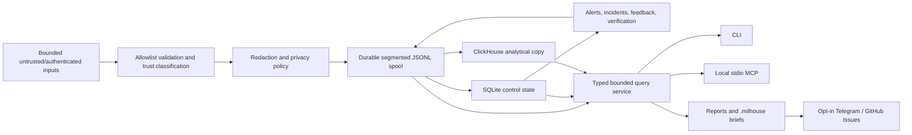

# Milhouse architecture

> Pre-alpha architecture summary. The normative contracts are sections 2-4 of `docs/implementation-plan.md` and their ratifying ADRs.

Milhouse is a local-first observability and verified-feedback control plane for a single operator or small engineering team across multiple targets.

## Durable flow

Every acknowledged record is redacted and durably committed to a self-describing spool segment before export or derived projection. A filesystem rename and SQLite commit are not treated as one transaction: startup/writer reconciliation registers valid orphan segments and reports missing files as unhealthy.

## Storage responsibilities

- **Segmented JSONL spool:** authoritative retained redacted record log and replay source.
- **SQLite:** spool/delivery ledger, cursors, leases, idempotency, alert/incident/feedback projections, and privacy-safe index metadata.
- **ClickHouse:** rebuildable analytical copy and bounded report/query acceleration.

ClickHouse failure never prevents unrelated durable collection. Deterministic record IDs and checkpoints provide at-least-once delivery with effectively-once logical results.

## Trust and privacy

- Allowlist normalization and redaction precede spool, state, logs, ClickHouse, terminal output, reports, diagnostics, notifications, and MCP.
- Restricted input is discarded; only separately normalized safe audit metadata may survive.
- Raw prompts, responses, transcripts, and tool output are never persisted in 1.0.
- Agent summaries/traces are structured, bounded, and disabled by default.
- Hosted storage, receiver remote bind, notifications, GitHub writes, and MCP writes are independent opt-ins.
- Third-party entry-point plugins are explicitly installed/allowlisted trusted code, not a sandbox.

## Processes and interfaces

- `milhouse run` is the scheduler process.
- `milhouse receiver serve` is a separate optional loopback receiver.
- `milhouse mcp serve` uses local stdio and is read-only by default.
- Application repository writes are limited to the configured `.milhouse/` directory and its ownership protocol.
- Services are rendered/installed only by explicit commands.

## Core domain behavior

Alerts, incidents, and feedback use deterministic append-only transitions with monotonic revisions and idempotent derivation. Feedback reaches `verified` or `regressed` only through the verification engine re-observing the configured signal class; an operator or agent cannot assert those outcomes directly.
