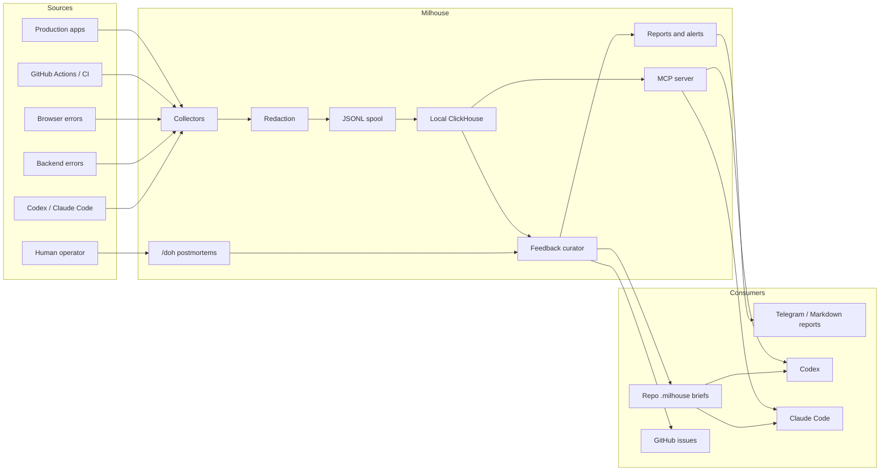

# Milhouse Architecture

Milhouse is a local-first observability and operations feedback platform for AI-assisted engineering teams.

The core idea is simple: collect signals from production, deploy systems, developer tools, and AI agents; normalize them into a small analytical model; store them locally first; and feed actionable findings back into humans and agents.

## Design Principles

- Local-first by default.
- Spool before export.
- Alert before external dependencies are required.
- Redact by default.
- Expose read-focused MCP tools before adding write automation.
- Keep application repos read-only except configured `.milhouse/` feedback directories.
- Treat workflow failures as team/system failures until the evidence says otherwise.

## High-Level Flow



## Components

### Collectors

Collectors ingest signals and convert them to normalized event records.

Initial collector families:

- site canaries
- Cloudflare analytics and Worker events
- GitHub Actions deploy events
- backend error reports
- browser error reports
- generic admin/workflow status APIs
- Codex session summaries
- Claude Code session summaries
- feedback outbox files

### Spool

Every event is written to local JSONL before export. This lets Milhouse keep collecting when ClickHouse, network, or third-party APIs are unavailable.

### Store

ClickHouse is the default local analytical store. It supports high-volume events, cheap local queries, and fast weekly/reporting workloads. Hosted ClickHouse can be added later as an optional deployment mode, but local ClickHouse is the default.

### Feedback Curator

The curator turns repeated patterns into `feedback_items`:

- production regressions
- stuck builds
- repeated agent tool failures
- missed validation
- browser/backend exceptions
- operator-marked `/doh` failures
- recurring prompt or planning problems

Feedback items move through:

```text
open -> accepted -> shipped -> verified
open -> accepted -> shipped -> regressed
open -> rejected
```

An item is not complete because an agent said it acted. It is complete when Milhouse verifies the production or workflow signal improved.

### MCP Server

MCP is the active read surface for agents.

Planned tools:

- `feedback_list`
- `feedback_get`
- `feedback_update_status`
- `events_query`
- `runs_status`
- `postmortem_create`
- `weekly_report_get`
- `health_summary`

Write operations should be narrow, auditable, and explicit.

### Repo Feedback Briefs

Milhouse also writes passive Markdown context into application repos:

```text
.milhouse/
  FEEDBACK.md
  AGENT_FEEDBACK.md
  TEAM_WORKFLOW.md
  feedback-outbox.jsonl
```

This lets agents see current operational feedback even when MCP is unavailable.

## `/doh`

`/doh` is an operator trigger meaning: the previous request or work set missed intent while being considered complete.

Milhouse should create a postmortem that includes:

- original request
- agent actions
- task status at the time
- missing validation
- mismatched assumptions
- operator contribution to ambiguity or scope drift
- corrective actions

The goal is accountability without turning postmortems into personal blame.
