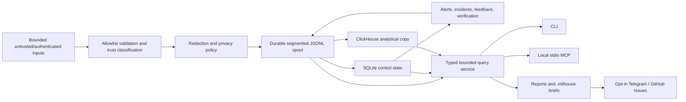

# Milhouse architecture

> Pre-alpha architecture summary. The normative contracts are sections 2-4 of `docs/implementation-plan.md` and their ratifying ADRs.

Milhouse is a local-first observability and verified-feedback control plane for a single operator or small engineering team across multiple targets.

## Durable flow

Every acknowledged record is redacted and durably committed to a self-describing spool segment before export or derived projection. A filesystem rename and SQLite commit are not treated as one transaction: startup/writer reconciliation registers valid orphan segments and reports missing files as unhealthy.

## Storage responsibilities

- **Segmented JSONL spool:** authoritative retained redacted record log and replay source.
- **SQLite:** spool/delivery ledger, cursors, leases, idempotency, alert/incident/feedback projections, and privacy-safe index metadata.
- **ClickHouse:** rebuildable analytical copy and bounded report/query acceleration.

ClickHouse failure never prevents unrelated durable collection. Deterministic record IDs and checkpoints provide at-least-once delivery with effectively-once logical results.

## Trust and privacy

- Allowlist normalization and redaction precede spool, state, logs, ClickHouse, terminal output, reports, diagnostics, notifications, and MCP.
- Restricted input is discarded; only separately normalized safe audit metadata may survive.
- Configuration construction crosses the bounded loader API; raw Pydantic models and their
  value-bearing validation internals are private implementation details.
- Public identity and record Pydantic models replace every ordinary validation failure with one
  fixed value-free error before the rejected object, nested location, or exception context can
  escape. Their concrete-model validators enforce strict types, forbidden extras, instance
  revalidation without structural coercion of foreign models, value-safe immutable
  copy/assignment/deletion (including unknown underscore state), refusal of initialized
  `self_instance` and repeated `__init__`, disabled pickle state export/restoration, JSON-only legacy
  raw parsing, and no legacy file/ORM parsing. Caller-created composite raw-JSON adapters are outside
  the ingestion boundary because their parser can fail before a model validator. Record drafts are
  explicitly
  post-allowlist/post-redaction inputs to finalization.
- Free-text redaction recognizes marked local/file-URI path grammars without a fixed filesystem-root
  allowlist, including repeated separator-bearing raw-space and shell-quoted continuations. The
  same-line raw scanner uses punctuation, markup, and field labels as terminators and fails with a
  value-free error when a separator first appears only after multiple ambiguous prose-shaped tokens
  or separator-free text would remain after the last confirmed continuation separator. HTTP URL
  paths stay under a separate bounded single-decode policy, which pseudonymizes complete components
  for filesystem-root signatures, PII, or double-encoding ambiguity and preserves safe paths outside
  those signatures. Same-length backtick runs adjacent to a new quote or opening markup tag also
  fail value-free when wrapper ownership is ambiguous; matching outer quotes and closing HTML tags
  are retained as valid boundaries.
- Redaction policy `r2` applies a bounded two-layer decoder graph for canonical-equivalent
  percent/JSON/HTML/base64/hex registered-secret forms, preserves valid decoded subruns beside
  malformed UTF-8 or misaligned hex input, recognizes MIME whitespace after every outer codec,
  validates generated pseudonyms again, and
  uses compact whole-value markers for typed path or URL collisions. Standalone percent-encoded
  local paths, exact filesystem-root segments at any URL path position, and unbracketed IPv6 share
  the same policy. A precomputed outer-wrapper suffix index keeps adversarial marked-path parsing
  near-linear at the 65 KiB input ceiling.
- Timestamp validators detach accepted caller values into exact UTC datetimes. Untrusted timezone
  callbacks cannot escape secret-bearing `BaseException` text through domain validation, clock
  formatting, canonical JSON, or content-hash derivation.
- Internal structured events accept catalog-owned machine event identities, allowlisted stable error
  codes, bounded code-owned numeric metadata, and keyed fingerprints derived inside the logger from
  a catalog-owned kind; they have no arbitrary-text or exception-detail field.
- One fail-closed egress matrix authorizes each surface/classification pair and returns its mandatory
  maximum content shape. External caller policy may narrow that matrix but cannot elevate it;
  restricted input is denied before surface-specific policy is considered.
- Raw prompts, responses, transcripts, and tool output are never persisted in 1.0.
- Agent summaries/traces are structured, bounded, and disabled by default.
- Hosted storage, receiver remote bind, notifications, GitHub writes, and MCP writes are independent opt-ins.
- Third-party entry-point plugins are explicitly installed/allowlisted trusted code, not a sandbox.
  Configuration validation performs no imports and inspects only each enabled allowlist entry's
  path-backed installed distribution metadata. It directly reads `METADATA`/`PKG-INFO` and
  `entry_points.txt` under respective 128 KiB and 64 KiB pre-parse caps, fails closed for unsupported
  metadata backends, and reuses one bounded snapshot per configured distribution in a validation
  pass. Both configured and installed raw version strings must be valid PEP 440, including epochs,
  and must then match exactly. Installed entry-point values must contain nonempty dotted Python
  identifier segments on both sides of `:` and must match the configured value exactly. Unlisted
  distributions are not discovered. W05 must revalidate and bind the exact entry-point object it
  will load so the checked metadata cannot authorize a different object.

## Processes and interfaces

- `milhouse run` is the scheduler process.
- `milhouse receiver serve` is a separate optional loopback receiver.
- `milhouse mcp serve` uses local stdio and is read-only by default.
- Application repository writes are limited to the configured `.milhouse/` directory and its ownership protocol.
- Services are rendered/installed only by explicit commands.

## Core domain behavior

Alerts, incidents, and feedback use deterministic append-only transitions with monotonic revisions and idempotent derivation. Feedback reaches `verified` or `regressed` only through the verification engine re-observing the configured signal class; an operator or agent cannot assert those outcomes directly.
