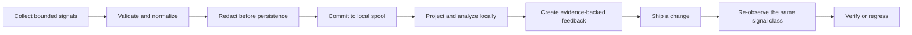

# Building Milhouse in public: foundations before features

> **Build Journal #1 — July 22, 2026.** Milhouse is pre-alpha, has no public release, and is not
> ready for production data. This post distinguishes code already verified on `main` from the
> architecture we are still building.

Milhouse is meant to turn operational evidence into engineering feedback that can later be proved
effective. That sounds like a dashboard problem. It is really a trust problem: before collecting a
single production signal, the system needs stable identity, privacy boundaries, deterministic
records, and a definition of what “verified” means.

## The architecture in one minute

The complete flow is the planned 1.0 architecture. Today, protected `main` contains the contracts
and privacy foundations at the front of that flow. The durable spool, SQLite and ClickHouse
integration, collectors, feedback runtime, reports, MCP server, and services remain future
dependency-bound work.

## What is implemented and verified

The W02 foundation now includes:

- strict versioned configuration with unknown-key rejection and deterministic JSON Schema output;
- canonical bytes, deterministic record IDs, content hashes, immutable record envelopes, and
  append-only feedback-transition validation;
- installation-keyed pseudonyms instead of public unsalted hashes;
- layered redaction, field allowlists, URL and path sanitization, and untrusted-text rendering;
- secure runtime-path and explicit secret-loading primitives;
- injected clocks, bounded duration parsing, stable coded errors, and catalog-owned structured
  operational events without arbitrary message fields;
- a fail-closed egress matrix for every planned persistence and output surface; and
- exact third-party plugin metadata validation without importing plugin code.

[PR #21](https://github.com/that1guy15/Milhouse-oss/pull/21) added a public-safe identity corpus and
recomputed the same identity wires in independent processes across mapping orders, hash seeds,
timezones, locales, Python 3.11 and 3.14 on macOS 14, and Python 3.11 through 3.14 on Ubuntu. It also
fixed strict raw-JSON draft parsing when an optional nested correlation object is omitted.

Why spend this much effort on identity? Because retry, replay, and outage recovery are normal in an
observability system. If identical evidence can acquire a different logical identity on another
process or platform, later storage cannot reliably deduplicate it and feedback cannot be traced to
the evidence that created it.

## A feedback loop, not an AI opinion

The central product rule is already locked even though its full runtime is not built: neither a
human nor an agent can simply declare work verified. Milhouse will require a new observation of the
same configured signal class after the change. A result can become verified when the evidence
improves, and regress when later evidence shows the problem returned.

That distinction is why the architecture starts with deterministic records and append-only state.
“The agent said it fixed it” is useful context. It is not verification.

## What the gates taught us

Our own delivery controls caught a malformed DCO trailer immediately after PR #21 was squash
merged. The production tree was exactly the reviewed tree and its source commit was correctly
signed, but the protected squash message contained escaped newline characters instead of a
parseable trailer. Required CI failed.

We did not rewrite protected history or weaken the checker. PR #22 added the bounded signed
remediation, PR #23 recorded the exact incident evidence, and the original malformed range remains
detectably noncompliant. The durable record is
[PR21-DCO.md](https://github.com/that1guy15/Milhouse-oss/blob/main/docs/gate-evidence/PR21-DCO.md).

That is the kind of failure an observability project should surface: specific, reproducible, and
recoverable without pretending it never happened.

## Verification evidence

- Protected evidence head:
  [`ce0aaecbf05f14b566d45446f756aeda24bfe1f3`](https://github.com/that1guy15/Milhouse-oss/commit/ce0aaecbf05f14b566d45446f756aeda24bfe1f3)
- Current-main Required CI:
  [`29910290888`](https://github.com/that1guy15/Milhouse-oss/actions/runs/29910290888)
- Identity portability implementation:
  [PR #21](https://github.com/that1guy15/Milhouse-oss/pull/21)
- Immediate DCO remediation and evidence:
  [PR #22](https://github.com/that1guy15/Milhouse-oss/pull/22) and
  [PR #23](https://github.com/that1guy15/Milhouse-oss/pull/23)
- Current work-package ledger:
  [implementation status](https://github.com/that1guy15/Milhouse-oss/blob/main/docs/implementation-status.md)

The required workflow covers quality, tests and coverage, Python compatibility, macOS identity
portability, package construction, artifact installation, secret scanning, dependency review,
license and vulnerability audit, CodeQL, DCO, and the fail-closed aggregate.

## What is not available yet

There is no supported Milhouse runtime deployment today. Durable spool and SQLite state, ClickHouse
delivery, collectors, feedback verification, reports, MCP, notifications, scheduling, recovery,
installation, and release artifacts are not yet accepted. Do not use the repository with production
credentials or telemetry.

## What comes next

W02 closes only after the remaining owner-approved contract decisions and their implementation
evidence are complete. The next production slices define the bounded local structured-log wire and
privacy authorization, then close G02. W03 can then build the crash-safe spool, SQLite state,
replay, and retention foundation that the runtime depends on.

Follow the
[Announcements build journal](https://github.com/that1guy15/Milhouse-oss/discussions/categories/announcements)
to watch each verified architecture slice land.
