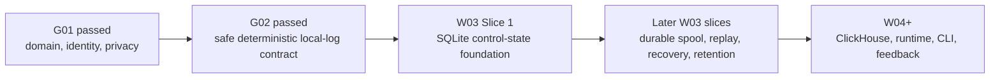

# Building Milhouse in public: from privacy contracts to durable storage

> **Build Journal #2 — July 24, 2026.** Milhouse OSS is still pre-alpha. There is no
> supported public release yet, and it should not be pointed at production data or credentials.

## The short version

Since the [first build journal](https://github.com/that1guy15/Milhouse-oss/discussions/25),
we completed and accepted **G02**, the gate that proves Milhouse's privacy-safe local logging
contract is complete, deterministic, bounded, and fail-closed.

That sounds abstract, so here is the practical meaning: before Milhouse starts writing durable
state, we now have a machine-checked answer to four important questions:

1. What operational metadata is allowed to leave an in-memory boundary?
2. What must never appear in a local log?
3. What exact bytes are written, in what order, and with what limits?
4. Will the same input produce the same safe output across supported Python versions and operating
   systems?

This was production code plus the evidence needed to trust it. It was not the durable storage layer
itself. With G02 accepted, **W03 is now unblocked**, and Slice 1 begins the SQLite control-state
foundation.

## What we actually built

### A fail-closed local logging boundary

Milhouse now treats local structured logging as an explicit egress surface. Data does not become
safe merely because it stays on the same machine. The common privacy matrix must authorize it, and
restricted data is rejected.

The stored event schema permits bounded operational metadata. It does not include prompts,
transcripts, tool output, arbitrary exception messages, credentials, raw paths, or other
uncontrolled content.

### A complete, deterministic wire format

The local log format is now a versioned JSON Lines contract with:

- a bounded segment header;
- bounded canonical event lines;
- a segment trailer;
- a SHA-256 digest covering the exact ordered bytes;
- explicit null and timestamp behavior;
- fixed key ordering and scalar types;
- per-line and per-segment limits; and
- an encoded retention deadline.

That contract matters because W03 can now persist and recover logs without inventing a file format
while implementing crash recovery.

### Failure behavior that does not leak

The stream sink requires authorization before writing and handles complete writes. Hostile
dependency failures—including iterator, timezone, and sink exceptions—are normalized to stable
Milhouse error codes rather than passing arbitrary exception detail into logs or terminal output.

### Evidence across processes and platforms

The test corpus locks golden bytes and checks determinism across processes, hash seeds, locales,
time zones, supported Python versions, Ubuntu, and macOS. Adversarial tests exercise leak-prone
values and failure paths. The G02 packet also enforces the project's 95% critical-branch coverage
floor across its scoped files.

## Why this took several pull requests

We intentionally split the work into small, independently reviewable slices:

- [PR #27](https://github.com/that1guy15/Milhouse-oss/pull/27) added the local-log privacy surface.
- [PR #28](https://github.com/that1guy15/Milhouse-oss/pull/28) added the canonical event-line projection.
- [PR #29](https://github.com/that1guy15/Milhouse-oss/pull/29) added golden vectors and cross-process determinism.
- [PR #30](https://github.com/that1guy15/Milhouse-oss/pull/30) added the injected stream sink.
- [PR #31](https://github.com/that1guy15/Milhouse-oss/pull/31) assembled the first G02 evidence packet.
- [PR #33](https://github.com/that1guy15/Milhouse-oss/pull/33) completed and hardened the wire contract.
- [PR #34](https://github.com/that1guy15/Milhouse-oss/pull/34) corrected the gate boundary.
- [PR #35](https://github.com/that1guy15/Milhouse-oss/pull/35) corrected the acceptance evidence and recorded deferred obligations.
- [PR #36](https://github.com/that1guy15/Milhouse-oss/pull/36) recorded the owner's G02 acceptance.

The review loops found real architectural defects:

- The first wire implementation encoded an event line but did not yet define the complete header,
  trailer, and digest required for recovery.
- Some hostile dependency failures could have exposed raw exception details.
- G02 initially required file, CLI, diagnostic, and report surfaces owned by later work packages.
  That created a circular dependency: W03 could not begin until G02 passed, while G02 demanded W03
  functionality.
- Parts of the evidence packet described coverage and review history more broadly than the artifacts
  proved.

We fixed those issues instead of accepting ambiguous contracts. The resulting amendments did not
weaken the privacy invariant. They assigned each concrete surface to the gate that actually owns it:

- W03 / G03: structured-log files and durable storage;
- W06 / G06: CLI, stderr, and diagnostics;
- W09 / G09: generated reports; and
- W16 / G16: backup, restore, and full-purge integration.

That distinction is a large part of what the extended review checked: that the implementation,
architecture plan, gate dependencies, tests, and public claims all described the same system.

## Where the architecture stands

G02 is a safety and serialization layer. It gives the durable system a stable boundary to build on;
it is not itself the durable system.

## What Slice 1 means

The first W03 slice begins from the accepted G02 baseline. According to the public implementation
plan, this slice establishes the SQLite control plane with:

- restrictive local permissions;
- WAL-mode operation;
- explicit transaction helpers; and
- ordered transactional migrations.

SQLite is control state—not a dumping ground for raw provider bodies, prompts, transcripts, or
arbitrary error text. Later W03 slices add the segmented spool, ledger, replay, corruption recovery,
leases, retention workflows, and crash/concurrency evidence.

**At the time of this journal, Slice 1 was in progress and was not claimed as merged or complete.**

## What is not built yet

G02 passing does **not** mean Milhouse is ready to install or operate. The project still needs,
among other work:

- the complete durable spool and SQLite lifecycle;
- crash recovery, replay, retention, and concurrency proof;
- ClickHouse storage and recovery;
- collectors and the runtime pipeline;
- CLI and diagnostic surfaces;
- alert, incident, feedback, query, and MCP workflows; and
- packaging, installers, upgrade/backup validation, and release candidates.

## Verifiable state

- Accepted G02 evidence: [docs/gate-evidence/G02.md](https://github.com/that1guy15/Milhouse-oss/blob/main/docs/gate-evidence/G02.md)
- Current implementation status: [docs/implementation-status.md](https://github.com/that1guy15/Milhouse-oss/blob/main/docs/implementation-status.md)
- Accepted protected `main`: [`f6044f8`](https://github.com/that1guy15/Milhouse-oss/commit/f6044f8322b70fe412192304dac4621fe505d8bd)
- Post-merge Required CI: [run 30065045513 — success](https://github.com/that1guy15/Milhouse-oss/actions/runs/30065045513)

The next update shows what the SQLite foundation delivered and which parts of G03 it made testable.
