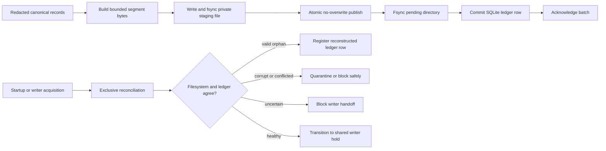

# Building Milhouse in public: when durable storage means recoverable evidence

> **Build Journal #3 — July 29, 2026.** Milhouse OSS is pre-alpha, has no public release,
> and is not ready for production data or credentials. This post describes low-level behavior
> verified on protected `main`; it does not claim that G03, the runtime, or Milhouse 1.0 is complete.

Since the [last build journal](https://github.com/that1guy15/Milhouse-oss/discussions/37),
Milhouse accepted G02 and moved from privacy-safe deterministic bytes into the first durable local
state and spool slices of W03.

## Why this matters

Writing a file is easy. Knowing what happened when a process dies between a file rename and a
database commit is the real durability problem.

Milhouse has two pieces of local truth at this stage: immutable JSON Lines spool files that carry
redacted canonical records, and SQLite control state that tracks what those files mean and where
their delivery stands. The filesystem and database cannot be committed in one atomic transaction.
W03 therefore has to make every intermediate state detectable, safe to retry, and recoverable
without inventing a false success.

## Implemented and verified

Protected `main` now includes W03 slices 1 through 3d:

- an owner-only SQLite control plane opened in WAL mode with full synchronous durability, foreign-key
  enforcement, explicit transactions, ordered checksum-bound migrations, and fixed safe errors;
- fenced named leases so a stale process cannot resume work after another process takes ownership;
- a cross-process global commit barrier that lets durable writers coexist while backup, restore,
  migration, and recovery can take exclusive maintenance authority;
- a versioned, self-describing spool segment format with bounded headers, canonical record frames,
  sequence checks, content digests, retention metadata, and strict identifiers;
- atomic no-overwrite segment publication followed by a durable SQLite ledger commit that records
  segment identity, scope, privacy class, byte size, retention, and exporter state;
- a bounded secure reader that refuses symlinks, unsafe ownership or modes, oversized input,
  malformed frames, sequence gaps, digest disagreement, and record-identity drift;
- mandatory reconciliation before writer handoff and before every durable commit, including safe
  registration of a valid durably published segment whose ledger transaction did not complete; and
- quarantine and recovery hardening for corrupt files, conflicting batch IDs, and exact stale writer
  artifacts without following symlinks, importing foreign file content, or treating an uncertain
  filesystem outcome as success.

These are library and recovery foundations. They are not yet a supported operator workflow.

## Architecture walkthrough

The acknowledgement boundary is deliberately late. A batch is not acknowledged merely because
bytes reached a temporary file or because a rename returned. The published file must be durable and
the SQLite transaction must commit.

If the process dies after publication but before the ledger commit, reconciliation can validate the
entire segment and register it as a reconstructed orphan. If a ledger row names a missing or
different file, Milhouse reports corruption instead of silently moving on.

Quarantine is also a durability workflow, not a convenient file move. The final implementation
classifies candidates without following links, copies and verifies bytes into a private staging
location, fsyncs publication, retires the exact source reversibly, and blocks on namespace drift or
uncertain cleanup. A06 makes the trust boundary explicit: the operating-system account running
Milhouse and the host administrator are trusted, while traversal, symlinks, untrusted input, other
local users, and cooperating-process races remain enforced boundaries. Hostile same-account
namespace interference remains a documented residual risk rather than a false containment claim.

## Verification evidence

- SQLite control state and coordination: [PR #38](https://github.com/that1guy15/Milhouse-oss/pull/38)
- Segment format and atomic writer: [PR #39](https://github.com/that1guy15/Milhouse-oss/pull/39)
- Durable segment commit and ledger: [PR #40](https://github.com/that1guy15/Milhouse-oss/pull/40)
- Secure segment reader: [PR #41](https://github.com/that1guy15/Milhouse-oss/pull/41)
- Reconciliation and regression evidence: [PR #42](https://github.com/that1guy15/Milhouse-oss/pull/42)
  and [PR #43](https://github.com/that1guy15/Milhouse-oss/pull/43)
- Quarantine and recovery hardening: [PR #44](https://github.com/that1guy15/Milhouse-oss/pull/44)
- Final PR #44 independent review:
  [PASS WITH CONDITIONS, no actionable findings](https://github.com/that1guy15/Milhouse-oss/pull/44#issuecomment-5109381880)
- Exact PR #44 Required CI: [run 30396642394](https://github.com/that1guy15/Milhouse-oss/actions/runs/30396642394)
- Protected merge: [`075d986`](https://github.com/that1guy15/Milhouse-oss/commit/075d98669d7c80fa12ac8e0306e4fb7124164223)
- Post-merge Required CI: [run 30397148604](https://github.com/that1guy15/Milhouse-oss/actions/runs/30397148604)
- Current work-package ledger: [implementation status](https://github.com/that1guy15/Milhouse-oss/blob/main/docs/implementation-status.md)

The exact PR #44 hosted run passed all 20 checks. Its test job reported 4,266 passed and two
platform-capability skips, 97.92% line coverage, 97.12% branch coverage, and every declared critical
file above the 95% critical-branch floor.

## What we learned

The useful failures were not ordinary happy-path bugs. Review found cases where an early quarantine
design could follow a staged symlink, where link/unlink/fsync ordering could make the report disagree
with the filesystem, and where recovery authority was too easy to imitate. Later rounds found
replacement and cleanup races that only appear when every syscall boundary is treated as a possible
crash boundary.

The durable lesson is that recovery code has to prove both the object and the namespace around it.
A file digest alone is not authority to unlink a pathname. A successful syscall alone is not proof
that the result survived a crash. And an uncertain outcome must remain uncertain until a later pass
can reconcile it.

## What is not available

G03 has not passed. The following remain in progress or planned:

- torn-tail salvage, persisted health, and the `spool verify` operator surface;
- replay and exporter checkpoints, including the 10,000-record twice-replay gate;
- retention and privacy-expiry completion;
- structured-log file persistence, rotation, recovery, and retention;
- supported-host physical crash and concurrency evidence;
- ClickHouse storage and recovery, collectors, the runtime, initialization, reports, feedback,
  MCP, notifications, services, and release artifacts.

There is still no supported installation or runtime deployment. Do not point this repository at
production credentials, telemetry, or agent content.

## What comes next

The next W03 slices finish the file, replay, recovery, retention, and operator-verification surfaces
required by G03. Structured-log file persistence is currently under review and is not included in
this milestone. W04's secure ClickHouse foundation is dependency-ready in parallel, but neither
package is a release or availability claim.
