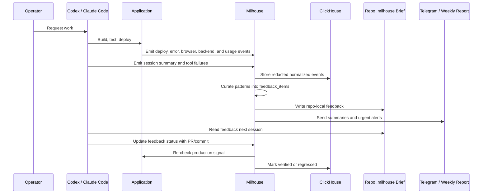

# Feedback Loop

Milhouse closes the loop between what the team builds, how it behaves in production, how AI agents work, and what the operator needs to improve next.

## Loop



## Feedback Item Lifecycle

```text
open -> accepted -> shipped -> verified
open -> accepted -> shipped -> regressed
open -> rejected
```

Completion requires verification against the same class of signal that created the item.

## Inputs

- production incidents
- backend exceptions
- browser exceptions
- deploy failures
- stuck workflow jobs
- site canary failures
- agent tool failures
- repeated validation misses
- operator `/doh` marks
- weekly trend summaries

## Outputs

- MCP queryable feedback
- repo `.milhouse/FEEDBACK.md`
- repo `.milhouse/AGENT_FEEDBACK.md`
- repo `.milhouse/TEAM_WORKFLOW.md`
- GitHub issues when configured
- Telegram weekly summary
- postmortem report

## `/doh`

`/doh` means the previous work set missed intent while being treated as complete.

Milhouse should investigate:

- user prompt clarity
- requirements and status docs
- agent plan and execution
- validation evidence
- production or workflow signals
- what was assumed
- what was skipped
- what would prevent recurrence

The operator is assumed to be in scope alongside every agent and process step.
