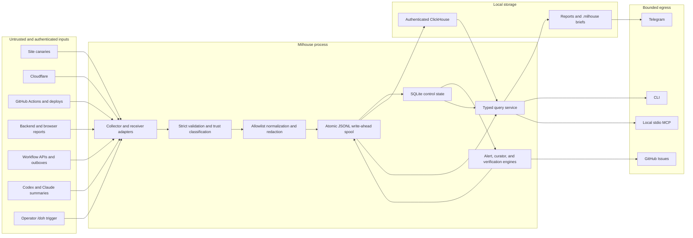
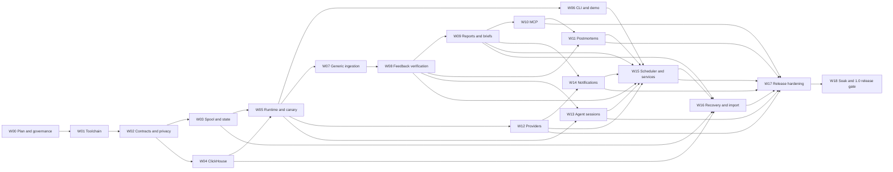

# Milhouse OSS Authoritative Implementation Plan

Plan version: 1.0
Status: Ready for approval and execution
Prepared: 2026-07-18
Target: Milhouse OSS 1.0
Public source baseline: `that1guy15/Milhouse-oss@fb81a7faf2c101e8bb3f08ef9120d82c2b20600b`
Private reference baseline: `that1guy15/milhouse@18ee9514ee11413812fde8fe361405b3686e025f`

## 1. Authority and change control

This document is the normative build contract for Milhouse OSS. The public product documents describe product intent; this plan resolves their ambiguities and supersedes conflicting implementation details in the private donor repository.

When the owner instructs Codex to begin the build, that instruction constitutes approval of plan version 1.0. Engineering must continue through release-candidate readiness rather than stopping at an intermediate alpha milestone. Push, publication, live-provider use, and post-publication verification still require their separately stated authority.

The following rules apply during implementation:

1. Locked public contracts, privacy guarantees, storage semantics, lifecycle rules, and release gates may not be changed implicitly.
2. An implementation detail may change without owner approval only when it preserves every external contract, security property, migration path, acceptance test, and user-visible behavior in this plan.
3. A necessary contract change requires a numbered plan amendment or ADR containing the reason, alternatives, compatibility impact, migration impact, security impact, and revised tests. Material scope, privacy, external-write, or data-loss changes require owner approval before implementation continues.
4. `docs/implementation-status.md` will track work-package state and evidence. Updating status is not a plan change.
5. The private repository remains read-only. No private history, telemetry, configuration, generated data, paths, personal labels, or private fixtures may be imported.
6. Any reused private code must be recorded in `docs/provenance.md`, generalized in a fresh public commit, independently reviewed, and covered by OSS tests.
7. Publication, pushing, package release, live-provider calls, and external messages remain separate owner-authorized actions even after the code is ready.

Process amendment A01, approved by the owner on 2026-07-19 and ratified by ADR 0015, establishes the
agent engineering workflow without changing a public API, stored schema, privacy promise, product
scope, or release gate. Instruction authority is: this plan, accepted ADRs,
`docs/implementation-status.md` for current evidence and authority, `AGENTS.md`, project skills, then
host-specific pointers. Selecting a skill grants no source, Git, GitHub, provider, external-model,
tag, publication, announcement, or messaging authority beyond the current status ledger.

Plan amendment A02, approved by the owner on 2026-07-22 and ratified by ADR 0016, defines the
persisted local structured-log contract in section 4.15 and adds the `local_log` egress surface to
section 4.7. It authorizes installation-scoped local operational metadata only, adds no external
egress, record, or publication authority, and expands no retention beyond the existing 14-day log
class. Amendment A03, approved by the owner on 2026-07-22 and ratified by ADR 0017, records the exact
bounded historical DCO disposition for the D01 PR #21 squash incident without weakening future
enforcement.

## 2. Product contract

### 2.1 Product definition

Milhouse is a local-first observability and verified engineering-feedback control plane for a single operator or small engineering team working across multiple application repositories, including AI-assisted workflows.

Milhouse will:

- collect production, deployment, workflow, error, and agent-session signals;
- normalize and redact them before durable storage;
- commit every acknowledged record to a local write-ahead spool;
- export analytical copies to an authenticated local ClickHouse instance;
- continue collecting and alerting while ClickHouse or an external provider is unavailable;
- turn repeated evidence into actionable feedback items;
- require observed evidence, rather than an agent claim, before marking feedback verified;
- expose bounded agent access through local MCP and generated `.milhouse` briefs;
- create neutral `/doh` postmortems across requirements, operator input, agent behavior, implementation, validation, documentation, and workflow;
- optionally deliver redacted summaries through Telegram and actionable items through GitHub Issues.

Milhouse will not require a hosted Milhouse service, external LLM, or remote analytics account.

### 2.2 Primary user and supported environments

The 1.0 primary persona is a single technical operator running Milhouse locally for multiple repositories and services.

Supported:

- Python 3.11 through 3.14;
- macOS 14 or newer;
- Ubuntu 22.04 and 24.04 LTS;
- Docker Engine/Compose for the reference ClickHouse deployment;
- ClickHouse 26.3 LTS as the reference line, pinned to an exact supported patch and image digest for each release;
- ClickHouse 25.8 LTS as the compatibility-test line while it receives security updates;
- MCP over local stdio.

Release compatibility exercises every Python version on Ubuntu 24.04, the oldest supported Python on Ubuntu 22.04, and the oldest plus newest supported Python on macOS. Clean-host gates run on Ubuntu 22.04, Ubuntu 24.04, macOS 14 (the minimum), and the latest generally available macOS at the RC freeze. Intermediate supported macOS releases are best-effort unless a reported regression makes them release-blocking. The evidence packet records exact OS patch, architecture, filesystem, Python, Docker, and ClickHouse versions; a later untested OS release is provisionally supported only after the clean-install smoke passes.

Documented but not release-blocking:

- WSL2;
- Podman-compatible Compose;
- externally managed or hosted ClickHouse.

Not supported in 1.0:

- native Windows services;
- multi-tenant hosting;
- a bundled web dashboard;
- remote MCP transport;
- automatic application/database mutation;
- direct browser-to-Milhouse ingestion with a public browser credential;
- raw prompt, response, transcript, or tool-output storage;
- call-home telemetry, crash uploads, usage analytics, or update beacons.

### 2.3 Naming and licensing

These names are locked for the build:

- Display name: `Milhouse`.
- Repository: `Milhouse-oss`.
- Python distribution: `milhouse-observability`.
- Python import package: `milhouse`.
- Command: `milhouse`.
- Docker/Compose resource prefix: `milhouse`.

Before the first public package publication, the owner will verify name availability and complete any desired trademark review. A naming issue may change the distribution and executable names through a plan amendment without changing the internal architecture.

The source license is Apache-2.0. Contributions use Developer Certificate of Origin sign-off; no CLA is required initially.

### 2.4 Release scope

The complete 1.0 build includes:

- secure installation and initialization;
- strict, versioned configuration;
- normalized records, deterministic identity, trust classification, and redaction;
- durable segmented JSONL spool and replay;
- SQLite control-plane state;
- authenticated ClickHouse, migrations, export, query, retention, backup, and restore;
- runtime scheduler and self-health;
- site canaries and stateful alert transitions;
- file/outbox, browser/backend report, workflow, Cloudflare, GitHub, generic admin API, Codex, and Claude Code integrations;
- feedback curation, lifecycle, verification, reports, and repo briefs;
- read-only MCP followed by explicitly enabled narrow writes;
- `/doh` postmortems;
- Telegram notifications and GitHub issue sink;
- launchd and systemd templates;
- legacy private-v0 import tooling;
- complete security, privacy, operations, contributor, and release documentation;
- package publication readiness and supply-chain attestations.

The build may produce alpha and beta artifacts, but it is not complete until all 1.0 gates pass.

## 3. Locked architecture

### 3.1 System topology



### 3.2 Storage responsibilities

Milhouse uses three deliberately separate storage layers:

1. **JSONL spool — durable record log.** A record is acknowledged only after an atomic, durable spool segment commit. The spool retains stable record IDs and is the replay source.
2. **SQLite control state — transactional local control plane.** SQLite stores spool segment states, provider cursors, scheduler leases, alert state, notification delivery state, idempotency keys, feedback projections, migration metadata, and audit metadata. It stores no raw provider bodies or agent transcript content.
3. **ClickHouse — derived analytical store.** ClickHouse contains redacted normalized records and append-only feedback history for fast analytical queries. Loss of ClickHouse does not prevent collection; it is recoverable from retained spool and backup.

The system provides at-least-once physical delivery with effectively-once logical query results through deterministic record IDs, content-conflict detection, delivery checkpoints, and deduplicating ClickHouse views.

### 3.3 Technology and dependency policy

The core application uses:

- the Python standard library for `asyncio`, SQLite, TOML reading, hashing/HMAC, JSON, file operations, and signal handling;
- Click for the CLI;
- Pydantic v2 for strict config/domain models and JSON Schema;
- `httpx` for bounded asynchronous HTTP clients;
- `platformdirs` for user config/data/cache paths;
- `python-dotenv` only for explicitly selected env files;
- `clickhouse-connect` for authenticated ClickHouse operations;
- the official `mcp` Python SDK for MCP;
- `filelock` for supported cross-process file locks where SQLite leases alone are insufficient;
- Starlette and Uvicorn in the optional `receiver` extra;
- setuptools as the build backend and `importlib.resources` for runtime assets.

The scheduler is implemented with `asyncio`; Milhouse does not add APScheduler or a separate broker. Core operation does not require OpenAI, Anthropic, LangSmith, Redis, PostgreSQL, or a hosted API.

Development dependencies include pytest, pytest-asyncio, Hypothesis, Ruff, mypy, coverage, respx, build, twine, pip-audit, YAML/Markdown/Compose validators, MkDocs Material, and SBOM tooling. Runtime ranges are bounded by compatible major versions; CI and releases use a hash-locked environment. Dependency additions require an ownership/maintenance/license/security assessment and must materially reduce implementation risk.

### 3.4 Runtime pipeline

Every collector and receiver must use exactly this pipeline. Scheduled collectors acquire a job lease and collector-run ID; receiver requests instead acquire a configured-source idempotency transaction and operation ID:

1. Acquire the applicable job lease or receiver idempotency transaction and create an operation ID.
2. Read only the configured source, applying timeout, page, byte, and record limits.
3. Parse into a source-specific input model.
4. Map only allowlisted fields into the canonical domain model.
5. Assign trust and privacy classifications.
6. Apply URL, path, secret, PII, and free-text policy.
7. Validate the fully redacted record.
8. Write and fsync the temporary segment; atomically rename it; fsync the parent directory; insert its validated ledger row; commit SQLite; then acknowledge the batch. Filesystem rename and SQLite commit are deliberately reconciled, not falsely treated as one atomic transaction.
9. Update a source cursor only in a SQLite transaction that references an existing committed segment ledger row.
10. Derive alert, incident, feedback, verification, and audit records from committed record IDs using per-rule/version checkpoints. Derivation is restartable, idempotent, and acyclic; advancing a source cursor does not mark derivation complete. Derived records use the same spool pipeline before their projection state advances.
11. Attempt required exporter delivery.
12. Acknowledge exporter checkpoints only after destination confirmation.
13. Attempt optional notifications from durable alert/feedback records, recording idempotent delivery state.
14. Emit a redacted collector-run outcome and release the lease.

Collectors cannot write directly to ClickHouse, SQLite projections, reports, application repositories, notifications, or MCP.

Failure semantics:

- Validation or redaction failure is fail-closed. The raw value is not persisted. Milhouse records only safe metadata, a reason code, and a keyed fingerprint.
- Spool failure is fatal for that batch; no export or notification occurs.
- ClickHouse failure leaves the segment pending and does not fail other collectors.
- Notification failure never rolls back collection and is retried idempotently.
- One collector failure never stops unrelated scheduled jobs.
- A duplicate ID with a different content hash is quarantined and raises a high-severity internal alert.
- Startup and every writer acquisition reconcile spool files and ledger state. A valid committed segment without a ledger row is registered; a ledger row without its segment is corruption and makes health unhealthy; stale temporary files are reported and recovered or quarantined by policy.

## 4. Canonical contracts

### 4.1 Configuration v1

Configuration is TOML validated by strict Pydantic models and exported as JSON Schema. The top-level key is `config_version = 1`. Unknown keys, duplicate IDs, invalid references, unsupported plugin versions, and unsafe paths are errors.

Canonical shape:

```toml
config_version = 1

[project]
name = "example-team"
default_target = "example-app"
timezone = "UTC"

[paths]
home = "../data"
spool = "spool"
reports = "reports"
logs = "logs"
backups = "backups"

[secrets]
env_files = ["../.env"]

[identity]
pseudonym_key_path = "control/pseudonym.key"

[plugins]
allow_third_party = false

[runtime]
mode = "full" # full or spool_only
log_level = "INFO"
max_batch_records = 500
max_batch_bytes = 5242880

[storage.clickhouse]
enabled = true
url_env = "MILHOUSE_CLICKHOUSE_URL"
username_env = "MILHOUSE_CLICKHOUSE_USER"
password_env = "MILHOUSE_CLICKHOUSE_PASSWORD"
database = "milhouse"
connect_timeout_seconds = 5

[privacy]
strict = true
agent_summaries_enabled = false
agent_trace_events_enabled = false
trace_excerpts_enabled = false
hash_local_paths = true

[retention]
events_days = 30
metrics_days = 90
runs_days = 180
alerts_days = 365
feedback_days = 365
agent_summaries_days = 30
trace_events_days = 14
reports_days = 90
logs_days = 14

[scheduler]
enabled = true
jitter_seconds = 5
shutdown_timeout_seconds = 30

[reports.daily]
enabled = true

[reports.weekly]
enabled = true

[[jobs]]
id = "replay-pending"
type = "spool_replay"
enabled = true
schedule = "interval"
interval_seconds = 60
timeout_seconds = 30
missed_run_policy = "run_once"

[[jobs]]
id = "collect-example-canary"
type = "collector"
collector = "example-canary"
enabled = true
schedule = "interval"
interval_seconds = 60
timeout_seconds = 15
missed_run_policy = "run_once"

[[jobs]]
id = "verify-feedback"
type = "feedback_verification"
enabled = true
schedule = "interval"
interval_seconds = 300
timeout_seconds = 60
missed_run_policy = "run_once"

[[jobs]]
id = "weekly-report"
type = "weekly_report"
enabled = true
schedule = "weekly"
weekday = "monday"
local_time = "08:00"
timeout_seconds = 120
missed_run_policy = "run_once"

[mcp]
enabled = true
transport = "stdio"
allow_writes = false
default_limit = 100
maximum_limit = 500
maximum_window_days = 30

[postmortem]
auto_on_doh_marker = true
default_window_hours = 24
scan_project_docs = true

[receiver]
enabled = false
bind = "127.0.0.1"
port = 8787
allow_remote = false
max_body_bytes = 262144
requests_per_minute = 60
clock_skew_seconds = 300

[[receiver.sources]]
id = "example-backend"
type = "hmac_v1"
target = "example-app"
secret_env = "MILHOUSE_INGEST_EXAMPLE_SECRET"
allowed_paths = ["/v1/ingest/events", "/v1/ingest/backend-errors", "/v1/ingest/browser-errors"]

[[receiver.sources]]
id = "example-github-webhook"
type = "github_webhook"
target = "example-app"
secret_env = "MILHOUSE_GITHUB_WEBHOOK_SECRET"
repository = "example/example-app"

[[targets]]
id = "example-app"
name = "Example App"
kind = "web_service"
environment = "production"
base_url = "https://example.com"
repo_path = "/absolute/path/to/example-app"

[[collectors]]
id = "example-canary"
type = "site_canary"
target = "example-app"
url = "https://example.com/health"
expected_statuses = [200]
request_timeout_seconds = 10

[[providers]]
id = "example-cloudflare"
type = "cloudflare"
account_id_env = "MILHOUSE_CLOUDFLARE_ACCOUNT_ID"
token_env = "MILHOUSE_CLOUDFLARE_TOKEN"

[[notifications]]
id = "team-telegram"
type = "telegram"
enabled = false
bot_token_env = "MILHOUSE_TELEGRAM_BOT_TOKEN"
chat_id_env = "MILHOUSE_TELEGRAM_CHAT_ID"
urgent_alerts = true
weekly_summary = true

[[alert_rules]]
id = "example-canary-state"
type = "canary_state"
collector = "example-canary"
consecutive_failures = 2
consecutive_successes = 2
cooldown_seconds = 300

[[incident_rules]]
id = "example-availability-incident"
target = "example-app"
alert_rule_ids = ["example-canary-state"]
group_dimensions = []
correlation_horizon_seconds = 900
quiet_window_seconds = 300

[[feedback_rules]]
id = "example-canary-recurrence"
type = "recurrence"
target = "example-app"
record_names = ["canary.state_changed"]
minimum_occurrences = 2
window_seconds = 86400
priority = "P1"
actionability = "needs_approval"
```

Rules:

- Config path precedence: global `--config` option, then `MILHOUSE_CONFIG`, then the platform user config path returned by `platformdirs`. No implicit current-working-directory lookup.
- Runtime home precedence: `MILHOUSE_HOME`, then `[paths].home`, then the platform user data path returned by `platformdirs`. Its canonical value is `STATE_ROOT`; all runtime child paths remain beneath it and never resolve against the working directory.
- Secret precedence: process environment, explicit CLI `--env-file`, then configured env files in declared order. Higher-priority values are never overwritten. `.env` is never auto-discovered.
- Path resolution is class-specific and never uses the current working directory:
  - `[paths].home` resolves against the directory containing the config file when relative;
  - `[paths].spool`, `reports`, `logs`, and `backups`, and `[identity].pseudonym_key_path`, resolve under the canonical runtime home when relative; absolute overrides must remain inside that home, and key-path escape is always invalid;
  - `[secrets].env_files` and standalone file-source paths resolve against the config directory when relative, then pass canonical-root and symlink policy;
  - `file_outbox.path` is repository-relative and must remain beneath its target's canonical `repo_path`;
  - target `repo_path`, Codex `sessions_root`, and Claude `projects_root` must be absolute canonical paths.
- Persisted timestamps are UTC. `[project].timezone` is a validated IANA zone used only for human display and report/service scheduling.
- Provider credentials are env-var references only. Secret values are never serialized by configuration commands.
- `config validate` performs offline checks. Live calls require `doctor --live`.
- `config show --redacted --show-sources` identifies value sources without printing secret values.
- Config migrations are explicit. Unsupported versions are never silently coerced.
- In config version 1, `trace_excerpts_enabled = true` is a validation error rather than a hidden unsupported mode.
- Built-in Milhouse components are statically registered and do not require plugin allowlisting. Third-party entry points are valid only when `[plugins].allow_third_party = true` and an exact `[[plugins.allowed]]` entry names `distribution`, exact installed `version`, `group = milhouse.collectors|milhouse.notifications|milhouse.exporters`, and `entry_point`. The configured `entry_point` is the exact Python `EntryPoint.value` (`module:attribute`), not its discovery alias/name. Python package-name normalization may locate candidates, but acceptance requires one exact raw installed metadata name, version, group, and value. Both raw version strings must be valid PEP 440, including epochs, before exact comparison; normalized-form equality is insufficient. Installed values must be syntactically valid dotted Python `module:attribute` references before exact comparison. Unknown, duplicated, version-mismatched, malformed, or installed-but-unlisted entries are refused without import; config diagnostics report only safe package metadata. Configuration validation reads only configured path-backed distribution metadata under pre-parse byte caps, fails closed for unsupported metadata backends, and reuses one snapshot per configured distribution during a validation pass. The future runtime registry revalidates immediately before loading and binds that result to the exact entry-point object it loads, so an earlier check or different object cannot become load authority after metadata drift.

### 4.2 Canonical record envelope

All durable records use a strict `RecordEnvelopeV1`:

```text
schema_version       literal "1.0"
record_id            deterministic Milhouse ID
record_type          event | metric | span | run | alert | incident |
                     feedback_item | feedback_transition | audit
name                 bounded machine name
occurred_at          source event time in UTC
observed_at          Milhouse observation time in UTC
ingested_at          envelope-finalization time immediately before serialization
expires_at           retention deadline in UTC
source_event_id      optional source-native ID, sanitized
source_entity_id     optional stable mutable-entity correlation ID, sanitized
dedupe_key           stable opaque digest
content_hash         SHA-256 of canonical redacted content
operation_id         required ID for the operation creating the record
collector_run_id     optional; required only for collector-produced records
scope                installation | target
source               typed source descriptor
collector            optional; required for collector-produced records and contains ID, type, plugin API, and implementation version
target               required only when scope is target; ID, name, kind, environment
severity             debug | info | warning | error | critical
trust_level          system | authenticated | local_untrusted | remote_untrusted
privacy_class        public | internal | sensitive | restricted
redaction_version    policy version
correlation          bounded trace/run/deploy/commit identifiers
dimensions           scalar-only bounded mapping
data                 discriminated typed record payload
```

Limits:

- 256 KiB maximum canonical record size;
- 100 dimensions maximum;
- 128-byte keys and 2 KiB scalar dimension values;
- 10 KiB maximum retained free-text field after redaction;
- URLs lose userinfo, query strings, and fragments unless a collector-specific allowlist explicitly retains safe keys;
- stack traces reduce to exception class and sanitized/hash-pseudonymized frames by default.

Identity rules:

- `record_id` is `mh_` plus a stable base32 SHA-256 digest of the canonical identity tuple.
- Records are immutable observations, not mutable provider-entity snapshots. The identity tuple includes schema/redaction identity, source identity, scope/target, record type/name, and an immutable source observation coordinate. `operation_id` and `collector_run_id` are correlation/provenance fields and do not participate unless the operation/run itself is the subject of that record. For a mutable entity, `source_entity_id` correlates revisions while provider revision, source `updated_at`, state transition, or another immutable observation coordinate participates in `record_id`. If no native coordinate exists, the collector uses documented stable coordinates such as scheduled canary time plus route ID, provider window bounds/revision, or file identity plus byte offset.
- Replay preserves the exact original record and batch identities.
- `batch_id`, sequence, and post-commit `committed_at` are spool-frame/ledger metadata, not canonical domain content.
- Canonical identity/content JSON uses UTF-8, sorted object keys, no insignificant whitespace, UTC RFC3339 millisecond timestamps, normalized enum/string forms, and documented exclusion of observation/delivery-only fields. IDs use lowercase unpadded base32 of SHA-256 with a fixed documented length. `content_hash` uses lowercase hexadecimal SHA-256 and includes all meaningful redacted source/domain content while excluding `operation_id`, `collector_run_id`, `observed_at`, `ingested_at`, `expires_at`, batch/delivery metadata, and the collector implementation version. If a parser revision intentionally changes meaningful normalized content for an existing source observation, that revision becomes an explicit identity coordinate rather than producing an unexplained conflict.
- `expires_at` is computed once from the first committed `ingested_at` and the applicable retention class. A later identical observation is a no-op and never extends retention; the first committed envelope remains authoritative.
- A repeated ID and hash is a no-op. A repeated ID with another hash is a conflict, not an update.
- Every collector contract documents its entity ID, observation/revision coordinate, correction semantics, and update fixtures. A provider correction creates a new observation linked by `source_entity_id`; it never mutates an earlier record.

Metric records also require:

```text
value
unit
metric_semantics = gauge | counter_delta | window_total | cumulative_counter
window_start     required for window_total
window_end       required for window_total
```

Reports may never sum overlapping `window_total` records. Cumulative counters must be converted to validated deltas before aggregation.

Record-specific payloads are strict:

- `event`: `category`, `status`, optional redacted `message`, and bounded typed attributes.
- `metric`: numeric `value`, `unit`, metric semantics, and required window metadata where applicable.
- `span`: `trace_id`, `span_id`, optional `parent_span_id`, `duration_ms`, and `status = ok|error|cancelled`.
- `run`: stable `run_id`, `run_type`, `status = success|failure|cancelled|timeout|partial`, start/end times, duration, and safe counts. Every collector execution emits one final run.
- `alert`: stable `alert_key`, rule ID/version, monotonic revision, `state = firing|resolved`, severity, summary, and evidence IDs. Repeated polls update rule state but do not create repeated firing transitions.
- `incident`: stable incident key, monotonic revision, `transition = opened|mitigated|resolved|reopened`, projected `state = open|mitigated|resolved`, severity, summary, and evidence IDs.
- `feedback_item` and `feedback_transition`: the fields and rules in section 4.6.
- `audit`: action, actor class/opaque ID, resource IDs, outcome/reason code, and safe counts. Audit records never contain the acted-on raw payload.

### 4.3 Spool format and state

State layout:

```text
STATE_ROOT/
  control/milhouse.sqlite3
  spool/
    pending/YYYY-MM-DD/<batch-id>.jsonl
    delivered/YYYY-MM-DD/<batch-id>.jsonl
    quarantine/YYYY-MM-DD/<batch-id>.jsonl
    tmp/
  reports/
  logs/
  backups/
```

Every segment is self-describing before it is renamed. Its first JSONL line is a `SegmentHeaderV1`; remaining lines are `SpoolFrameV1` records containing `frame_version`, `batch_id`, `sequence`, `record_id`, and the complete redacted record envelope. The immutable header contains frame/schema versions, batch ID, configuration-generation digest, scope/target, privacy and retention class, required exporter IDs, expected record count, and SHA-256 digest of the ordered record-frame bytes. Every segment contains exactly one scope and, for target scope, one target plus one compatible privacy/retention class. A segment is written to a unique temporary file, flushed, fsynced, atomically renamed, and followed by a parent-directory fsync. SQLite then records matching header metadata plus `committed_at`, total byte size/file digest, and delivery status before acknowledgement. Post-rename recovery uses only the durable header to register an orphan and never infers its delivery policy from newer configuration.

Constraints:

- one writer transaction per segment;
- multiple processes coordinate through SQLite leases and file locking;
- every durable writer—scheduler, receiver, CLI, MCP, manual collection, notification/audit worker, and plugin-mediated operation—must acquire the shared side of the global commit barrier. Backup/restore/migration and other declared maintenance operations take the exclusive side; no code path may bypass it;
- temporary or partial files are never treated as committed;
- corrupt committed files move to quarantine with a safe reason report;
- valid records before a corrupt trailing frame remain recoverable;
- startup and writer acquisition reconcile valid orphan files into the ledger, flag missing-file ledger rows unhealthy, and recover or quarantine stale temporary artifacts;
- source cursors advance only after segment commit;
- pending segments are never pruned merely because they are backlogged, but record-class privacy expiry remains a hard upper bound; expiry of unexported data produces a critical health/audit event before safe removal;
- a delivered record remains in the redacted spool/archive until its own record-class `expires_at`; mixed-expiry compaction follows the audited rewrite protocol below, so full and spool-only modes retain the same configured logical history;
- full mode never prunes the last recoverable copy of an unexpired record. ClickHouse is rebuildable from the retained redacted spool; verified backups protect control state and provide additional recovery coverage;
- spool-only mode immediately marks the local spool as the satisfied destination but retains delivered segments for configured retention;
- `spool replay` processes pending segments only unless an explicit immutable segment is named;
- `spool verify` validates the header, frame schema, sequence, header/frame and whole-file digests, IDs, ledger agreement, and backup/destination watermarks.

### 4.4 SQLite control state

SQLite runs in WAL mode with transactional migrations and restrictive permissions. It contains:

- schema version and migration checksums;
- segment and exporter delivery ledgers;
- privacy-safe spool record index entries containing record ID, scope/target, type/name, occurred time, segment/offset, expiry, and content hash but no raw payload;
- provider/file cursors;
- collector leases, next-run times, and latest outcomes;
- alert rule state and cooldowns;
- notification idempotency and retry state;
- receiver nonces and request idempotency keys;
- feedback items and append-only transition projection;
- audit metadata and retention outcomes.

It must not contain raw provider responses, raw browser/backend bodies, raw agent records, prompts, responses, or tool output.

### 4.5 ClickHouse schema and migrations

SQL migrations are immutable package resources with version, checksum, application time, status, and Milhouse version. Commands are `storage status`, `storage plan`, and `storage migrate`.

Initial migration series:

1. `0001_core.sql`: database, migration ledger, common conventions.
2. `0002_records.sql`: canonical redacted records, `expires_at` TTL, logical deduplication by `record_id` and newest `ingested_at`.
3. `0003_feedback.sql`: feedback item creations and append-only transitions.
4. `0004_views.sql`: current feedback, latest runs/alerts/incidents, source freshness, and safe metric aggregation views.

The reference `records` table uses `ReplacingMergeTree(ingested_at)` with a key containing target, record type, and record ID. Correctness-sensitive queries use deduplicated views or `FINAL`; local scale takes priority over premature optimization. A feedback-current view derives state from valid transitions using `argMax` over the locked revision/time/transition-ID order in section 4.6. No normal operation uses `ALTER TABLE ... UPDATE` or deletes a record in place.

Migrations:

- refuse an altered checksum for an applied version;
- never automatically drop data, reduce retention, or perform an irreversible conversion;
- support plan and status without mutation;
- are tested from every supported previous schema;
- recommend and verify a backup before a future destructive migration;
- include rollback guidance even when the migration itself is forward-only.

### 4.6 Alert, incident, and feedback contracts

#### Alerts and incidents

An alert identity is the deterministic fingerprint of rule ID/version, scope/target, and configured grouping dimensions. Alert state is system-derived:

```text
inactive -> firing -> resolved
resolved -> firing   # a new recurrence creates a new transition under the same alert key
```

Opening and recovery use configured consecutive-sample/hysteresis rules. Late observations are retained but cannot reverse a state derived from a newer source observation. Severity changes, evidence additions, firing, and resolution are append-only alert events. Cooldown suppresses duplicate notification delivery, not state/evidence. Every transition identifies the triggering evidence and rule version.

An incident groups related firing alerts by the target, alert-rule allowlist, bounded scalar `group_dimensions`, `correlation_horizon_seconds`, and `quiet_window_seconds` declared by a strict `[[incident_rules]]` entry. All referenced alert rules must resolve to the same target or an explicitly target-agnostic rule. Incident state is system-derived:

```text
open -> mitigated -> resolved
mitigated|resolved -> open  # emits a reopened transition event
```

An incident opens from a qualifying alert or explicit postmortem trigger, is mitigated when active symptoms resolve but the stabilization window remains open, resolves after every member alert is resolved and the configured quiet window passes, and returns to `open` with a `reopened` transition event on correlated new evidence. Severity is the maximum active evidence severity and changes through append-only events. Evidence membership is append-only. Recurrence cycles through open/mitigated/resolved/open are explicitly tested. Alerts and incidents are read-only through public CLI/MCP in 1.0; operators act through feedback and postmortem workflows rather than mutating operational history.

Alert and incident derivation is serialized per deterministic key. Every event carries previous/new state, monotonic per-key revision, triggering observation coordinate, and deterministic transition ID. The engine checks the last processed evidence coordinate and performs the same segment-ledger plus SQLite projection CAS protocol used for feedback; stale or repeated evidence is a no-op. ClickHouse latest-state views order by revision and transition ID. This prevents concurrent scheduler/receiver derivation, late samples, or replay from forking current state.

#### Feedback items and lifecycle

A feedback item contains:

```text
item_id
fingerprint
created_at
target_id
title
summary
recommendation
severity
priority          P0 | P1 | P2 | P3
actionability     observe | investigate | agent_safe | needs_approval
confidence        low | medium | high
owner             optional actor reference
evidence_ids
verification_spec
trust_level
privacy_class
```

`verification_spec` is a strict `VerificationSpecV1`, not executable code. It contains schema version, originating rule ID/version, target, `signal_class = canary|error|deploy|workflow|metric|agent_summary|validation`, typed record-name/dimension filters, one typed predicate (`state_equals`, `no_recurrence`, `count_at_most`, `ratio_at_least`, `latency_at_most`, or `validation_passed`), threshold/unit where applicable, minimum observations, observation window, deadline, and allowed lateness. It accepts no SQL, regex supplied by telemetry, command, URL, or filesystem path. Manual evidence may satisfy shipment validation but cannot by itself assert production verification.

Canonical states and transitions:

```text
open      -> accepted | rejected
accepted  -> open | shipped | rejected
shipped   -> verified | regressed
regressed -> accepted | rejected
rejected  -> open
verified  -> regressed
```

Requirements:

- every transition is an append-only `feedback_transition` record;
- every transition contains deterministic `transition_id`, item ID, `from_state`, `to_state`, monotonically increasing per-item `revision`, caller-supplied `expected_revision`, actor type/ID, timestamp, rationale, request/idempotency ID, and evidence;
- item creation is revision 0. A state-changing operation acquires the item lock, validates `expected_revision`, writes exactly revision N+1, and atomically commits the segment ledger plus SQLite projection CAS after the segment rename. Writer reconciliation completes a valid orphan transition before another mutation may acquire the item. A stale expected revision fails without producing a transition; a repeated request ID returns its original result;
- ClickHouse current-state views use `argMax` over the total-order tuple `(revision, occurred_at, transition_id)`, and health cross-checks item revision/state against SQLite;
- `accepted` requires an owner;
- `shipped` requires a commit, PR, or equivalent change reference plus validation evidence;
- no human or agent may directly assert `verified`;
- `verified` and `regressed` require a verification observation generated against the same signal class described in `verification_spec`;
- reopening rejected or regressed work requires a reason;
- returning accepted work to open requires a reason and clears its owner only when explicitly requested;
- verified work can regress only from new evidence;
- GitHub issue state never overrides Milhouse verification state;
- current status is a derived projection, never an in-place source-of-truth mutation.

Actor authority is derived by Milhouse, never accepted as an untrusted request field. Local CLI operator identity is installation ID plus local OS principal; MCP identity is the configured server/client context plus local OS boundary; scheduled changes use fixed system/verifier actors. `agent_safe` items may be accepted/shipped through explicitly enabled agent writes. `needs_approval` items can be accepted, rejected, or reopened only by the operator; after operator acceptance, the assigned agent may ship with required evidence. Only the verification engine may emit `verified` or `regressed`; version 1.0 has no operator override for either outcome.

The curator is deterministic and rule-driven before any optional AI enhancement. A rule declares source types, grouping/fingerprint fields, threshold/window, suppression/cooldown, output severity/priority/actionability, and the typed verification specification. Its fingerprint is the stable digest of rule ID/version, target, normalized grouping values, and verification-signal identity. Re-running curation over identical evidence cannot create another open item.

### 4.7 Trust, privacy, and prompt-injection boundary

Every provider response, browser/backend message, repository file, CI record, webhook, issue, agent-generated string, and operator-supplied evidence is data, not authority.

Binding policies:

- collector field allowlists are the primary control; pattern redaction is defense in depth;
- `restricted` is an input classification and fail-closed ceiling: no canonical restricted record may reach a persistence or egress surface. Milhouse discards the value and may emit only a separately normalized internal/sensitive audit record containing a reason code, bounded safe counts, and keyed fingerprint;
- redaction happens before spool, SQLite projection, ClickHouse, logs, terminal output, reports, diagnostics, notifications, or MCP;
- secret values, authorization headers, cookies, signed URLs, URL query strings, emails, user content, and local paths are removed or pseudonymized according to policy;
- pseudonyms use a keyed installation-local HMAC, never a public unsalted hash;
- untrusted text is length-bounded, escaped, visibly labelled as evidence, and never rendered as executable instructions;
- Milhouse never executes commands, code, SQL, URLs, or tool calls contained in telemetry;
- raw Codex/Claude transcripts, prompts, responses, and tool output are never persisted in 1.0;
- agent summary collection is disabled by default;
- agent trace events, when enabled, contain structured categories and counts, not content excerpts;
- trace excerpts remain disabled in 1.0 and require a future privacy ADR to implement;
- hosted ClickHouse, Telegram, and GitHub are independent egress policies and remain disabled by default;
- diagnostic bundles show a manifest preview and contain no raw records by default;
- no data is uploaded automatically.

Installation identity and pseudonym-key lifecycle:

- `init` generates a 32-byte pseudonym key at the configured path under `STATE_ROOT`, with mode `0600`, plus a non-secret key ID/version in SQLite;
- the key is never logged, stored in config, included in ordinary diagnostics, or transmitted;
- normal backups exclude it and declare identity continuity unavailable unless the operator supplies the original key during restore;
- `backup create --include-recovery-secrets --encryption-recipient RECIPIENT` may include it only in an encrypted recovery-secrets envelope; plaintext recovery-secret export is forbidden;
- restore verifies the key ID before accepting identity continuity and otherwise requires an explicit new-identity acknowledgement;
- key rotation is explicit and audited, increments the pseudonym epoch/redaction version, and may retain the prior key for a bounded overlap in which new observations receive both pseudonym epochs. Historical cross-epoch correlation cannot be fabricated after the raw value is gone;
- key creation, loss, wrong-key restore, encrypted backup, overlap, and rotation behavior have dedicated tests.

Egress policy:

| Surface | Public | Internal | Sensitive | Restricted |
|---|---:|---:|---:|---:|
| Redacted local spool | Yes | Yes | Yes | Never |
| Local SQLite/ClickHouse | Yes | Yes | Yes | Never |
| CLI local query | Yes | Yes | Policy-filtered summary | Never |
| Local stdio MCP | Yes | Yes | Policy-filtered summary | Never |
| Repo Markdown briefs | Yes | Yes | No | Never |
| Telegram | Yes | Explicit opt-in summary | No | Never |
| GitHub Issues | Yes | Explicit opt-in summary | No | Never |
| Hosted ClickHouse | Yes | Explicit opt-in | Separate explicit allowlist | Never |
| Diagnostics bundle | Metadata | Redacted metadata | No by default | Never |
| Local operational log | Metadata | Redacted metadata | No | Never |

The `Local operational log` surface persists only installation-scoped operational metadata; its wire, namespace, durability, rotation, recovery, and lifecycle are defined in section 4.15.

Default retention:

| Data class | Days |
|---|---:|
| General events | 30 |
| Metrics | 90 |
| Runs | 180 |
| Alerts, incidents, feedback | 365 |
| Agent summaries | 30 |
| Structured trace events | 14 |
| Delivered spool | Until each contained record's data-class expiry |
| Reports | 90 |
| Logs | 14 |
| Pending spool | Until successful delivery or the record-class privacy expiry, whichever comes first |
| Backups | Manual policy |

Spool, ClickHouse, and SQLite projections retain records for their data-class periods. Pending records remain retryable until delivered or until their data-class privacy expiry. Compaction rewrites only expired frames into a new fsynced segment, records old/new hashes and lineage transactionally, and unlinks the superseded file only after verification; interruption is restartable. Milhouse does not promise forensic secure erasure on SSD, copy-on-write, snapshot, or journaled storage. Privacy-sensitive operators must use encrypted volumes and apply platform/media sanitization when retiring storage. `retention preview` lists exact counts and bytes without mutation. `retention apply --confirm` records an audit event.

Target purge is an explicit destructive workflow. `milhouse targets purge TARGET --dry-run` produces an exact manifest and digest. Confirmation requires both `--confirm TARGET` and that manifest digest. The command acquires an exclusive target maintenance fence plus the compaction/retention fence, blocks every scheduler, receiver, CLI, MCP, manual-collection, notifier, audit, and plugin write for that target, and revalidates the manifest before mutation. It then removes that target's pending, delivered, and quarantine segments; SQLite projections; ClickHouse rows using a mutation that is waited on and verified; and generated briefs. The fences remain held through verification and the final metadata-only purge audit tombstone. Immutable backups containing the target are listed separately. Partial deletion is resumable, makes health unhealthy until resolved, and is covered by race and interrupted-purge tests.

### 4.8 Collector and plugin contract

First-party and third-party collectors implement plugin API v1:

```text
metadata()             name, version, API version, capabilities
config_model()         strict Pydantic model
collect(context)       normalized source results and proposed cursor
health(context)        offline/live health result
fixture_contract()     supported synthetic fixture versions
privacy_manifest()     accepted, retained, transformed, and discarded fields
```

Collector results contain records, the proposed source cursor, safe diagnostics, retry classification, and source freshness. The runtime, not the collector, persists results.

Plugins are discovered only through installed Python entry points:

- `milhouse.collectors`
- `milhouse.notifications`
- `milhouse.exporters`

Configuration cannot import an arbitrary module or execute a script. Every plugin declares file/network/write capabilities, follows common bounds/retry behavior, and passes the public plugin contract test kit.

Entry-point plugins are trusted local Python code executing in-process with the Milhouse user's authority. Capability/privacy manifests are declarations for review, diagnostics, and policy compatibility—not a sandbox. Milhouse never installs plugins automatically; the operator must install the distribution and add it to an explicit config allowlist. Containing a malicious installed plugin is outside 1.0 and would require a separate-process sandbox ADR and enforcement design.

First-party collectors:

1. `site_canary`
2. `file_outbox`
3. `error_report_file`
4. `workflow_file`
5. `cloudflare`
6. `github_actions`
7. `generic_admin_api`
8. `agent_summary`
9. `codex_session`
10. `claude_session`

All collector configs share `id`, literal `type`, `target`, and `request_timeout_seconds`; unknown fields remain fatal. The request timeout bounds individual source I/O; the job's `timeout_seconds` independently bounds the whole execution. Collectors contain no schedule or enabled flag: an explicit `[[jobs]]` entry of `type = "collector"` references the collector and is the sole scheduling/enablement authority. Manual `collect run` remains available for a configured collector. Type-specific v1 fields are locked as follows:

| Type | Required fields | Optional/defaulted fields |
|---|---|---|
| `site_canary` | `url`, `expected_statuses` | method GET only, `follow_redirects=false`, TLS verification; latency and consecutive-state thresholds belong to alert rules |
| `file_outbox` | repo-relative `path` | producer allowlist, maximum line/file bytes, acknowledgement filename, rotation glob |
| `error_report_file` | `path`, `input_schema_version` | JSON/JSONL mode, maximum record bytes; stdin is a one-shot CLI override only |
| `workflow_file` | `path`, `input_schema_version` | JSON/JSONL mode, workflow/run type mapping |
| `cloudflare` | `provider`, zone/account target mapping, selected metric families | late-arrival overlap, page size, window size; every window is revision-aware and deduplicated |
| `github_actions` | `provider`, `repository` | workflow/environment allowlists, polling lookback, page size, include deployments |
| `generic_admin_api` | `provider`, HTTPS `base_url`, GET `path`, declarative mapping list | pagination JSON pointers, response-size/page limits; mutating methods are invalid |
| `agent_summary` | `path`, `input_schema_version` | JSON/JSONL mode and target alias mapping |
| `codex_session` | allowlisted `sessions_root` and target/repo mappings | structured trace categories; excerpts and collector-owned polling cadence are invalid |
| `claude_session` | allowlisted `projects_root` and target/repo mappings | structured trace categories; excerpts and collector-owned polling cadence are invalid |

Provider configs are strict discriminated unions:

- `cloudflare`: account ID env reference, analytics token env, optional separately scoped Workers token env, API endpoint override limited to HTTPS, and allowed account/zone aliases;
- `github`: API URL, read token env, repository allowlist, API version, and optional separately named issue-write token used only by W14;
- `generic_http`: auth mode `bearer|header`, token env, header name/scheme, TLS policy, host allowlist, retry/rate limits, and maximum response bytes;
- `clickhouse_hosted`: URL/user/password env references, database, TLS requirements, and egress privacy allowlist.

Notifier configs are also strict:

- `telegram`: token/chat env references, allowed classifications, report/urgent switches, message limit, and retry policy;
- `github_issues`: provider reference, repository, label allowlist, enabled feedback priorities/actionabilities, allowed classifications, preview requirement, and idempotent item marker.

The generated config JSON Schema is the exhaustive machine contract. These tables fix semantics; implementation may add only nonbreaking optional fields through the version/change process.

### 4.9 Application-repository contract

Milhouse can write only inside the exact configured `<repo>/.milhouse` directory after canonical path and symlink checks.

Ownership:

- the application or CI owns and appends `feedback-outbox.jsonl`;
- Milhouse reads the outbox and never truncates, rotates, or rewrites it;
- Milhouse owns an atomic `outbox-ack.json` containing producer/file identity, committed byte offset, last record ID/hash, and acknowledgement time;
- Milhouse owns generated `FEEDBACK.md` and `AGENT_FEEDBACK.md`;
- the application team owns `TEAM_WORKFLOW.md`; `milhouse init` may create it only when absent and never overwrites it;
- source cursor and inode/offset state live in Milhouse SQLite, not the application repo;
- generated files use atomic replacement and mode `0600`;
- repeated generation is deterministic apart from declared generation metadata;
- `.milhouse` integration files are ignored by default unless the application owner intentionally commits a schema/readme file.

Outbox records use a versioned JSON schema, stable producer ID, occurred time, target, kind, actionability, evidence references, and bounded structured data. File identity plus byte offset is only a fallback identity. A compliant producer fsyncs complete lines, retains every rotated file until `outbox-ack.json` covers its EOF, and rotates to a monotonically named immutable file. Milhouse discovers retained rotations in order. If a producer truncates or removes unacknowledged bytes, Milhouse detects the discontinuity and emits a P1 data-loss alert; it cannot claim recovery of deleted bytes. `milhouse repo init|status TARGET` creates/validates schemas, safe ignore rules, acknowledgement state, and producer examples without overwriting team content. Rotation, truncation, duplicate IDs, partial lines, and corrupt lines have explicit recovery/detection tests.

### 4.10 Query contract

All CLI, MCP, reports, and verification jobs use one typed query service. It provides cursor pagination and never accepts raw SQL.

Default bounds:

- 24-hour time window;
- 100 rows;
- 500-row maximum;
- 30-day maximum interactive window;
- indexed spool/archive access across the retained record-class window when ClickHouse is unavailable, with the same query time/page bounds and a configurable hard cap on total candidate records.

Every result reports data source, freshness, truncation, next cursor, degraded state, and trust/privacy metadata. ClickHouse errors are visible; fallback is never silent. Spool-only mode uses the SQLite metadata index to avoid linear full-archive scans. A result is marked partial only when the retained archive cannot answer an equivalent query, data is corrupt/missing, or a candidate safety bound is reached. Feedback current-state reads use SQLite and are cross-checked against ClickHouse during health checks.

### 4.11 MCP contract

Milhouse uses the official Python MCP SDK, pinned to `mcp>=1.27,<2` for plan version 1.0. Moving to MCP SDK 2 requires an explicit compatibility amendment because stable v2 was not yet released when this plan was written.

Transport is local stdio. Tools return structured, bounded output.

Read tools:

- `feedback_list`
- `feedback_get`
- `events_query`
- `runs_status`
- `incidents_recent`
- `health_summary`
- `weekly_report_get`
- `agent_trace_query` only when structured trace collection is enabled

Narrow write tools:

- `feedback_accept`
- `feedback_ship`
- `feedback_reject`
- `feedback_request_verification`
- `postmortem_create`

Write tools require both `[mcp].allow_writes = true` and the launch flag `milhouse mcp serve --allow-writes`. They operate only on known IDs through domain services, require request ID/rationale/current `expected_revision` for state changes, enforce the same CAS state machine, derive actor identity, and are idempotent. MCP cannot accept SQL, shell commands, arbitrary paths, arbitrary URLs, or an authoritative caller-supplied actor ID.

The committed MCP example uses an absolute installed executable or environment-specific interpreter and an absolute config path. MCP conformance is tested with the official client SDK, including initialize lifecycle, cancellation, limits, errors, and duplicate writes.

### 4.12 Ingestion receiver contract

The optional receiver is disabled and loopback-only by default. Remote binding requires `allow_remote = true`, an explicit CLI acknowledgement, and documented TLS termination.

Endpoints:

- `GET /v1/healthz`
- `POST /v1/ingest/events`
- `POST /v1/ingest/backend-errors`
- `POST /v1/ingest/browser-errors` for authenticated application-backend relays
- `POST /v1/webhooks/github`

`X-Milhouse-Source` must match a configured `[[receiver.sources]]` entry and target/path allowlist. `X-Milhouse-Timestamp` is canonical base-10 Unix seconds with no sign or leading zero; `X-Milhouse-Nonce` is 16-128 printable ASCII characters. Requests with query strings are rejected. The canonical path is the exact configured ASCII endpoint path; alternate percent encodings, dot segments, encoded slash/backslash/NUL, and duplicate-slash variants are rejected rather than normalized. The signature input is the exact UTF-8/byte sequence `v1\n<timestamp>\n<nonce>\n<UPPERCASE_METHOD>\n<canonical_path>\n<SHA256_HEX(raw_body)>`. The header is `X-Milhouse-Signature: v1=<lowercase-hex-HMAC-SHA256>`, compared in constant time. Defaults are 256 KiB per request, 100 records, 60 requests/minute/source, five-minute clock skew, and ten-minute nonce retention. Replayed nonces are rejected transactionally. Optional `previous_secret_env` and `previous_secret_expires_at` are either both absent or both present; the deadline must be a valid future RFC3339 UTC timestamp. Secret rotation accepts that previous secret only before the deadline and audits its use.

GitHub webhooks use the exact raw body, `X-Hub-Signature-256`, configured repository/target mapping, persisted delivery-ID idempotency, and the configured webhook secret. Browser code should relay through its application backend; Milhouse does not ship a public browser secret pattern. CORS is disabled by default. All request content is remote-untrusted regardless of authentication.

The receiver is a separate foreground process started by `milhouse receiver serve`; `milhouse run` never starts a listener. Scheduler and receiver have separate service templates and leases but share the SQLite control state and spool through the documented multi-process protocol. Proxy, restart, duplicate-delivery, secret-rotation, and multi-process rate-limit tests are required.

### 4.13 Scheduler and process contract

`milhouse run` is the foreground long-running scheduler. `milhouse run --once` executes every due job once and exits. Each collector also supports an explicit one-shot execution through `milhouse collect run <id>`.

The scheduler provides:

- versioned `[[jobs]]` with ID, built-in/plugin job type, enabled state, target/reference IDs where applicable, timeout, missed-run policy, and an interval, daily, or weekly schedule;
- interval execution is based on monotonic time; calendar schedules resolve the configured IANA project timezone to UTC on each run, including DST transitions, while every persisted time remains UTC;
- deterministic next-run computation plus bounded jitter;
- one SQLite lease per job;
- configurable timeouts and exponential backoff;
- job timeout bounds parsing/network/derivation work, but cancellation is shielded once the durable segment commit protocol begins; shutdown either completes file+ledger durability or leaves an artifact that mandatory reconciliation can classify before reporting the job outcome;
- graceful SIGINT/SIGTERM shutdown;
- missed-run policy `skip` or `run_once`, default `run_once`;
- no overlapping execution of the same job;
- independent failure domains;
- structured heartbeats and stale-job detection.

Built-in job types cover spool replay, feedback curation/verification, notification retry, retention apply, daily report, weekly report, backup verification, and provider/collector jobs. Each domain work package registers its job only after the underlying service exists; W16 adds backup verification to the scheduler delivered in W15. Secure defaults are generated by `init`; every required scheduled behavior has an explicit job record and can be inspected with `run --once`/health.

No service is installed or started by setup. Generic launchd and systemd templates call absolute executable/config paths and are installed only through an explicit documented command.

### 4.14 Reports, notifications, and postmortems

Daily and weekly Markdown reports are generated from the common query service and contain:

- data freshness and degraded sources;
- Milhouse health and export backlog;
- canary/availability transitions;
- deploy and workflow outcomes;
- incident and error trends;
- open, shipped, verified, and regressed feedback;
- structured agent-workflow friction when enabled;
- explicit evidence windows and missing-data caveats.

Telegram is disabled by default, escapes Markdown safely, chunks within provider limits, retries with backoff, and records idempotent delivery without token-bearing URLs. GitHub issue creation is disabled by default, uses a least-privilege token, embeds a hidden Milhouse item marker for idempotency, and never decides verification state.

`/doh` creates a neutral postmortem from explicitly approved evidence. Its input contract includes target, reason/original-intent summary when available, bounded time window, optional run/session/commit correlations, and whether configured project documents may be scanned. It may inspect configured project planning/status documents read-only and Milhouse records inside bounded windows. Raw local agent logs can be parsed transiently only when the operator explicitly supplies or enables an allowlisted source; raw content is not persisted or exported. An opt-in agent collector that detects an explicit `/doh` marker emits a durable request event; the scheduler runs the postmortem automatically when `auto_on_doh_marker` is enabled, while clearly reporting any missing original-intent evidence. The report labels quoted telemetry untrusted, assigns accountability across the complete system, creates corrective feedback items, and supplies verification criteria. It does not use personal-name or profanity heuristics.

### 4.15 Structured log persistence

Structured logs are installation-scoped local operational metadata. They are never a record, audit, replay, verification, acknowledgement, or feedback authority, and logging can never control or roll back record acknowledgement. The `local_log` egress surface (section 4.7) authorizes only `public → metadata` and `internal → redacted metadata`; `sensitive` and `restricted` are denied. No target IDs, paths, URLs, credentials, payloads, exception text, arbitrary messages, prompts, transcripts, responses, tool output, or provider content may enter the stored wire, stderr, or any exception or traceback. Safe counts or keyed fingerprints derived from rejected data are reclassified as internal metadata before this boundary. No external log egress or private-donor logging reuse is authorized.

The stored wire is bounded `CanonicalJSONV1` UTF-8 JSONL with one LF per line and no BOM. `StructuredLogHeaderV1` carries version, line type, installation scope, a positive signed-64 sequence, canonical `opened_at`, and captured `retention_days`. `StructuredLogEventLineV1` carries version, line type, internal privacy class, canonical timestamp, a catalog-owned event name, level, sorted typed metrics, a normalized coded error, and an optional validated installation-keyed fingerprint; it has no arbitrary-text or exception-detail field. `StructuredLogTrailerV1` carries sequence, `closed_at`, `last_event_at`, `event_count`, `content_sha256`, and `expires_at`. `content_sha256` covers the exact header plus the ordered event-line bytes including their LFs and excludes the trailer. The existing in-memory `StructuredLogEventV1` remains constructor-controlled; the stored line is a separate exact projection.

Files live under the securely resolved `[paths].logs` directory inside the runtime home: `structured-log.current.jsonl`, rotated `structured-log.<20-digit-sequence>.jsonl`, a `.structured-log.next.tmp` staging file, and a `structured-log.lock`. Rotated sequences use exactly twenty decimal digits; sequence reuse is forbidden until a confirmed full installation purge, and overflow fails closed. The directory is mode `0700` and files are mode `0600`; access requires the correct owner, a regular file, a single hard link, a safe ACL, no symlink, no directory replacement, and no unsafe foreign matching file, using descriptor-relative, no-follow, close-on-exec handles. Milhouse fails closed when a required platform protection is unavailable.

A successful emit means one complete event line was appended, not that it is crash-durable; flush, clean shutdown, and rotation fsync the active descriptor. Log failures emit only fixed safe `MH_LOG_*` metadata and never recursively invoke the same sink. Rotation happens before an append when the resulting segment including its reserved trailer would exceed 8 MiB, the UTC day changes, the retention policy changes, or maintenance finds it due, following a fixed fsync, trailer, no-replace rename, directory-fsync, next-header, and publish order. Recovery covers every write, fsync, and rename crash boundary: a torn incomplete active tail is truncated to its last LF, while complete malformed lines, conflicting sequences, foreign inodes, unexpected trailers, and ambiguous current/rotated/temporary combinations fail closed. Closed rotations are immutable.

The lock order is global barrier lease then `structured-log.lock` then descriptors; existing barrier authority is passed through rather than reacquired; recovery, retention, restore, and full purge take exclusive maintenance authority before the log lock; and the global barrier is never acquired while the log lock is held. Bounds are at most 4,096 bytes per event line including its LF, at most 1,024 bytes per header or trailer including its LF, at most 8 MiB per segment including its trailer, at most 10,000 enumerated rotations, and a five-second lock wait on injected monotonic time. There is no compression in v1.

Default `[retention].logs_days` remains 14. Each segment captures its retention at rotation; a tightening may shorten an unexpired deadline, but a later relaxation never extends an already captured deadline. Retention deletes only validated closed segments after expiry with a descriptor-bound unlink and a parent fsync, and rotates an active segment before removing it. Backups exclude logs; restore never imports source-host logs and preserves destination-host logs; target purge leaves installation-scoped logs to ordinary expiry because the wire holds no target identity; and a confirmed full installation purge removes logs under exclusive maintenance authority. Pre-init commands do not create the log directory. `stderr` uses the exact event-line bytes with no file header, trailer, or sequence.

Ownership follows the work packages: W02 owns the wire, encoder, `local_log` privacy authorization, golden vectors, and sink interface; W03 owns filesystem persistence, crash recovery, multiprocess and global-barrier integration, and retention preview/apply; W06 owns the CLI and stderr binding; and W16 owns backup, restore, and full-purge integration. No public stored-log format has shipped, so this contract is v1 with no migration and does not implicitly adopt preexisting matching files; a future wire change requires a new version and compatibility plan. This contract was added by plan amendment A02 and is ratified by ADR 0016.

## 5. CLI contract

Global options:

```text
milhouse --config PATH --env-file PATH --json --log-level LEVEL --version
```

Command surface:

```text
milhouse init [--profile spool-only|full] [--config PATH] [--non-interactive]
milhouse config validate|show|schema
milhouse doctor [--live]
milhouse health
milhouse demo [--profile spool-only|full]

milhouse run [--once] [--collector ID]
milhouse collect list
milhouse collect run ID [--fixture PATH] [--dry-run]
milhouse canary [--target ID] [--dry-run]       # documented shorthand

milhouse spool status|verify|replay|prune
milhouse storage up|down|status|plan|migrate
milhouse events query
milhouse runs status
milhouse incidents list

milhouse feedback list|get|accept|ship|reject|reopen|request-verification|curate|brief|ingest
milhouse report daily|weekly
milhouse postmortem create
milhouse doh                                      # alias for postmortem create

milhouse agent ingest-summary
milhouse agent collect codex|claude
milhouse agent poll

milhouse receiver serve
milhouse mcp serve [--allow-writes]
milhouse plugins list|validate
milhouse repo init|status TARGET

milhouse retention preview|apply
milhouse targets purge TARGET --dry-run
milhouse targets purge TARGET --confirm TARGET --manifest-digest SHA256
milhouse backup create|list|verify
milhouse restore
milhouse import legacy-v0 config|spool|clickhouse
milhouse diagnostics preview|create
milhouse service render|install|status|uninstall launchd|systemd
```

CLI rules:

- human output goes to stdout and structured logs/errors to stderr;
- `--json` emits one stable JSON result on stdout and nothing else;
- destructive or externally mutating commands support dry-run and require an explicit confirmation flag;
- state-changing feedback commands require a request ID, rationale, `--expected-revision N`, and `--confirm ITEM_ID`; `accept` also requires owner, while `ship` requires typed change and validation-evidence IDs. `request-verification` binds to the current revision, schedules an observation, and cannot select its outcome;
- `health` exits 0 healthy, 1 degraded, and 2 unhealthy;
- invalid CLI/config exits 2; operation failure exits 1; security-policy refusal exits 5; migration-required exits 6;
- command documentation and reference pages are generated or tested from the same Click definitions;
- no command depends on the repository working directory.

## 6. Target repository layout

```text
Milhouse-oss/
  .agents/
    skills/                  # relative aliases to the five canonical skill folders
  .github/
    CODEOWNERS
    dependabot.yml
    workflows/
      ci.yml
      integration.yml
      security.yml
      nightly.yml
      docs.yml
      release.yml
  config/
    example.toml
    examples/
  docs/
    adr/
    runbooks/
    solutions/               # sanitized reusable engineering knowledge, never sessions
    skill-evaluations.md      # sanitized fresh-agent behavior evidence, never transcripts
    implementation-plan.md
    implementation-status.md
    architecture.md
    getting-started.md
    configuration.md
    data-model.md
    collectors.md
    plugin-authoring.md
    feedback-loop.md
    agent-integration.md
    mcp.md
    postmortems.md
    privacy.md
    threat-model.md
    deployment.md
    operations.md
    backup-restore.md
    upgrade.md
    troubleshooting.md
    development.md
    release.md
    provenance.md
    support.md
    governance.md
  examples/
    emitters/
    fixtures/
    reports/
  ops/
    clickhouse/
    launchd/
    systemd/
  schema/
    json/
  skills/
    milhouse-ops/
    milhouse-feedback/
    milhouse-gate-review/
    milhouse-compound/
    milhouse-oss-maintainer/
  src/milhouse/
    cli/
    core/
    config/
    domain/
    privacy/
    spool/
    state/
    delivery/
    storage/clickhouse/
    collectors/
    runtime/
    alerting/
    feedback/
    reporting/
    notifications/
    query/
    interfaces/mcp/
    interfaces/ingest/
    postmortem/
    health/
    resources/
  tests/
    unit/
    property/
    contract/
    integration/
    e2e/
    security/
    migration/
    packaging/
    fixtures/
  CHANGELOG.md
  AGENTS.md
  CLAUDE.md
  CODE_OF_CONDUCT.md
  CODEX.md
  CONTRIBUTING.md
  GOVERNANCE.md
  LICENSE
  Makefile
  PRIVACY.md
  README.md
  SECURITY.md
  SUPPORT.md
  pyproject.toml
  setup.sh
```

Migrations, config/report/service templates, JSON schemas, and other runtime resources live inside the Python package and are included in both wheel and sdist. Repository copies used by operators are generated from those package resources so clone and installed-package behavior cannot drift.

## 7. Source reuse and provenance plan

### 7.1 Public OSS baseline

W00 begins from the tracked files at the audited public baseline, not its local caches or generated environment. Apache license, community templates, issue/discussion forms, and documentation intent are retained after truth/provenance review. Existing architecture/project/feedback documents are source requirements reconciled into this plan; they are not allowed to override its locked contracts.

The current public Python package, config examples, Compose file, setup wrapper, workflows, and CLI
are scaffolding. Each is replaced or expanded through its owning work package and may be claimed in
README only after its gate passes. Five engineering-process skills, their discovery aliases, and the
canonical instruction hierarchy are established at G00; command-bearing product guidance is added
only after its owning gate passes and is revalidated at W17. The duplicate `ops/github/workflows`
copies are removed in favor of `.github/workflows`; OpenWiki remains optional and noncanonical.

The private system is an algorithm and behavior reference, not the new base.

### 7.2 Adapt with focused review

- UTC parsing and `since` duration ideas from `timeutils.py` into `core/clock.py`.
- Export protocol/result shape from `exporters/base.py` into `delivery/base.py`.
- Timestamp and JSON serialization ideas from the ClickHouse exporter.
- Site-canary request/normalization behavior, rebuilt behind v1 models and alert rules.
- Provider-format knowledge and aggregate counters from Codex/Claude parsers.
- Telegram retry/chunking behavior after a new egress/privacy layer.
- Selected formatting ideas from reports and feedback briefs.

File-level donor disposition:

| Private donor path | Disposition | New owner area | Mandatory adaptation guardrail |
|---|---|---|---|
| `src/milhouse/timeutils.py` | Adapt small pure helpers | `core/clock.py` | Inject clock; strict UTC/DST and fuzz tests |
| `src/milhouse/exporters/base.py` | Adapt result/protocol ideas | `delivery/base.py` | v1 idempotency/checkpoint contract replaces donor state behavior |
| `src/milhouse/exporters/clickhouse.py` | Reference serialization/type mapping | `storage/clickhouse/` | New migrations, auth, dedupe, spool checkpoint, and failure model |
| `src/milhouse/collectors/site_canary.py` | Adapt HTTP observation behavior | `collectors/site_canary.py` | New config/domain/privacy/runtime boundaries; no direct persistence |
| `src/milhouse/collectors/cloudflare.py` | Reference endpoint/window semantics | `collectors/cloudflare.py` | Revision-aware windows and metric semantics prevent overlap inflation |
| `src/milhouse/collectors/agent_session.py`, `agent_logs.py` | Reference format recognition only | provider-neutral agent adapters | Synthetic fixtures, opt-in summaries, no raw content/path/command storage |
| `src/milhouse/notify.py` | Adapt retry/chunking ideas | `notifications/telegram.py` | New opt-in egress classification, preview, idempotency, and audit layer |
| `src/milhouse/reports/briefs.py` | Adapt presentation ideas | `reporting/` | Common bounded query service and untrusted-text renderer only |
| Donor tests for the rows above | Translate behavior, never copy private fixtures | corresponding OSS test suites | Regenerate wholly synthetic fixtures and add v1 failure/security cases |

### 7.3 Rewrite against v1 contracts

- configuration and secret loading;
- record models and IDs;
- redaction and privacy classification;
- state, spool, runtime, replay, and checkpointing;
- ClickHouse schema, migrations, exporter, and query layer;
- alerts, feedback state, curator, and verification;
- outbox, production-error, Cloudflare, GitHub, and admin/workflow collectors;
- MCP server;
- CLI;
- reports and postmortems;
- agent polling and checkpoints;
- all operational packaging.

### 7.4 Do not copy

- `TokruConfig`, Tokru collectors, target/service aliases, personal report language, or private defaults;
- legacy harnesses and private docs/history;
- private launchd labels or local paths;
- `.mcp.json`, private env-file fallbacks, or private Makefile defaults;
- private fixtures, generated state, reports, spools, ClickHouse data, or session files;
- raw transcript content or personal/profanity classification heuristics;
- the private `project_baseline` gate as a core Milhouse feature.

### 7.5 Donor defects explicitly prohibited

- random IDs and duplicate replay;
- permanent rereading of every spool/outbox record;
- plain `MergeTree` logical duplicates;
- ClickHouse in-place feedback status mutation;
- state saved before durable evidence or notification retry state;
- overlapping Cloudflare totals summed as deltas;
- silent query fallback or ignored time filters;
- top-level fields bypassing redaction;
- raw traces enabled by default;
- path/CWD/branch/prompt/tool-output persistence;
- untrusted telemetry rendered as agent instructions;
- arbitrary output paths;
- hand-rolled fixed-version MCP;
- missing ignored test fixtures;
- package builds that omit migrations/templates/assets.

### 7.6 Legacy import

Legacy import is explicit, dry-run-first, repeatable, and source-preserving.

- `import legacy-v0 config` maps private `sites`, alerts, thresholds, provider accounts, and workflow settings into v1 targets/providers/collectors. Private-only fields generate manual-action warnings. It never imports secret values.
- `import legacy-v0 spool` passes each line through v1 allowlist normalization and redaction, assigns deterministic identity, preserves legacy IDs/status in reconciliation metadata, and excludes raw agent traces by default. `open` remains open; `proposed` becomes open with `legacy_status=proposed`; `dropped` becomes rejected through an importer-actor transition with deterministic request ID and migration rationale. `shipped`, `verified`, and `regressed` are reconstructed only when complete owner/change/same-class verification evidence satisfies v1; otherwise they become open/manual-review or quarantine. Import never fabricates verification evidence.
- `import legacy-v0 clickhouse` reads old tables and writes a new database namespace. It never mutates the old database.
- Every import produces counts, hashes, ID mappings, exclusions, quarantines, and a machine-readable reconciliation report.
- A second import produces identical logical results.

### 7.7 External engineering-workflow reference

Milhouse uses `EveryInc/compound-engineering-plugin` at immutable commit
`8163a96e86656a89797869ac61905fe4641f81be` (MIT, Copyright 2025 Every) as a
conceptual process reference only. ADR 0015 independently adapts implementation readiness,
progressive disclosure, bounded delegation, causal debugging, simplification, risk-selected
report-only review, explicit PR states, and grounded durable learning.

Milhouse does not install, vendor, execute, or depend on that plugin and imports none of its agents,
scripts, assets, configuration, or session tooling. Raw-session discovery, raw-feedback persistence,
standing source-write authority, implicit GitHub mutation, external code/context egress, and plaintext
credential propagation are explicitly prohibited. Any future copied or substantially adapted
expression requires file-level provenance and preservation of the upstream MIT notice.

## 8. Ordered implementation work packages

The sequence is dependency-bound. Parallel work is allowed only after the shared contract gate noted below.

### 8.0 Resolved decision register

Sections 2 through 7 are the resolved decision register. They lock product scope and naming; supported platforms; process topology; technology stack; configuration and every first-party integration schema; installation identity/key lifecycle; record/payload/identity/metric semantics; spool/SQLite/ClickHouse commit and recovery; alert/incident/feedback state; trust/privacy/egress policy; plugin trust model; repository ownership; receiver signing; scheduler jobs; reports, notifications, postmortems, MCP, CLI, packaging, migration, legacy import, and the five-skill engineering workflow and authority boundary. W00 ADRs ratify and cross-reference these outcomes; they do not reopen them. If implementation discovers an unstated public or stored contract, plan status returns to Draft until a plan amendment resolves it.



### W00 — Repository, authority, governance, and ADRs

Deliverables:

- populate the implementation workspace from the audited OSS public head without importing private history;
- create branch `codex/build-milhouse-v1`;
- retain this plan as `docs/implementation-plan.md` and create status tracking;
- ratify ADRs for product scope, naming, config, records/identity, spool/state, ClickHouse, feedback, privacy, plugins, scheduler, MCP, receiver, packaging, and support; each ADR must reproduce and cross-reference this plan rather than choose new outcomes;
- correct README status to pre-alpha until the corresponding gates pass;
- create `PRIVACY.md`, threat model, support, governance, and provenance inventory;
- ratify ADR 0015; establish the five canonical engineering skills, `.agents/skills` relative
  discovery aliases, canonical `AGENTS.md`, thin host pointers, external-reference provenance, and
  executable skill validation;
- enable a workable private vulnerability-reporting and review path;
- confirm Apache-2.0 ownership/provenance and DCO policy;
- remove stale private-first publication and duplicate-workflow instructions.

Gate G00:

- no unresolved decision can change a public interface or stored schema;
- the private repository is documented as donor-only and remains untouched;
- the merge/review path is actually usable;
- the plan and ADR index agree.
- required CI proves all five engineering skills are non-placeholder, plan-aligned, privacy-safe,
  metadata-valid, reference-complete, and discoverable through resolving relative aliases;
- sanitized fresh-agent evidence separately exercises every skill's positive procedure and
  adjacent-negative boundary without persisting raw prompts, responses, or transcripts.

### W01 — Package and quality-toolchain foundation

Deliverables:

- installable `milhouse-observability` package with modular CLI and package resources;
- runtime/dev/optional dependency separation and a reproducible CI lock;
- Ruff format/lint, strict typing, pytest, branch coverage, Hypothesis, build, `twine check`, package inventory, docs/link validation, `pip-audit`, gitleaks, CodeQL, and dependency review;
- unit/property/contract/integration/e2e/security/migration/packaging test layout;
- explicitly tracked synthetic JSON/JSONL fixtures;
- runtime-generated adversarial secret values for security tests so committed fixtures do not contain scanner-triggering credentials;
- stable `make` targets that always use the project environment;
- GitHub Actions with least privilege and immutable full-SHA action references.

Gate G01:

- clean clone installs with the canonical contributor command;
- wheel and sdist install in empty environments;
- `milhouse --help` and `milhouse --version` work from installed artifacts;
- package resources are present;
- a planted disposable secret makes every secret-scan path fail;
- CI fails on any required quality gate.

### W02 — Domain, configuration, identity, trust, and privacy

Deliverables:

- strict Pydantic config and domain models;
- path/secrets loader and JSON Schema exports;
- deterministic ID/content-hash implementation;
- safe URL/path sanitization, field allowlists, layered redaction, HMAC pseudonyms, and untrusted renderer;
- injected clock and bounded duration parser;
- safe structured logging, including the section 4.15 persisted `local_log` wire, encoder, privacy authorization, golden vectors, and sink interface, and stable error codes;
- validated public config examples and adversarial privacy corpus.

Gate G02:

- every example validates and unknown keys fail clearly;
- identical identity input yields identical IDs across processes/platforms;
- secret values never appear in exceptions, logs, CLI, records, reports, or diagnostics;
- the `local_log` wire (section 4.15, amendment A02) is byte-stable across supported platforms and never emits secrets, PII, paths, prompts, transcripts, or tool output to files, stderr, exceptions, or tracebacks;
- property tests cover nested, encoded, Unicode, multiline, Markdown/HTML, URL, path, PII, and prompt-injection cases;
- security-critical modules reach at least 95% branch coverage.

### W03 — SQLite state, durable spool, replay, and retention

Deliverables:

- SQLite migrations, restrictive permissions, WAL mode, transaction helpers, and leases;
- atomic segmented spool, ledger, verify, quarantine, checkpoint, replay, prune, and corruption recovery;
- exporter protocol and pipeline checkpoint semantics;
- retention preview/apply and safe audit records;
- crash/concurrency/failure-injection harness.

Gate G03:

- kill before rename exposes no partial batch;
- kill after commit loses no acknowledged records;
- concurrent writers produce valid noninterleaved segments;
- corrupt tails preserve valid frames and are quarantined safely;
- replaying 10,000 records twice yields identical logical IDs and counts;
- files/directories are `0600`/`0700` where supported;
- pending data is never pruned before its explicit record-class privacy expiry; intentional audited expiry is detected and is not reported as accidental loss.
- failure injection covers temporary write, file fsync, rename, directory fsync, ledger insert/commit, cursor update, derivation/checkpoint, export, destination confirmation, and exporter checkpoint.

### W04 — Secure ClickHouse, migrations, repository, and recovery

Deliverables:

- loopback-only Compose with supported patch/digest, dedicated non-empty credentials, health check, resource guidance, and no remotely usable default account;
- packaged SQL migrations and checksum-protected runner;
- typed authenticated client, exporter, deduplicated query repository, and spool fallback contract;
- ClickHouse backup/restore support and version compatibility tests.

Gate G04a — database/schema, independent of W03:

- anonymous access fails and authenticated host access succeeds;
- a fresh deployment migrates to the full schema;
- migration status and checksum enforcement work;

Gate G04b — delivery/recovery integration, after G03:

- repeated export/replay is logically idempotent;
- 24-hour simulated outage recovery drains without duplicates;
- a native backup restores cleanly and matches record IDs, exporter checkpoints, and migration state. Feedback-state backup parity is added at G16 after W08 exists.

### W05 — Runtime, collector registry, canary, alerting, and vertical slice

Deliverables:

- plugin registry and common collector context/result;
- runtime pipeline enforcing validation/redaction/spool/export ordering;
- bounded shared HTTP client with TLS, retry, redirect, and SSRF policies;
- site-canary collector;
- alert rules for failure, latency, recovery, consecutive samples, cooldowns, and source freshness;
- durable notification-intent records;
- spool-only and ClickHouse modes.

Gate G05:

```text
canary -> validate -> redact -> spool -> alert -> ClickHouse -> query
```

passes end to end. With ClickHouse stopped, collection and local alert transitions continue; restart drains exactly once logically. First failure, repeated failure, recovery, cooldown, timeout, redirect, and malformed-target behavior are tested.

### W06 — Initialization, CLI, diagnostics, and deterministic demo

Deliverables:

- global CLI and `init`, `config`, `doctor`, `health`, `demo`, `storage`, `collect`, `spool`, `events`, `runs`, and `incidents` commands;
- idempotent initialization with no implicit services or live calls;
- spool-only five-minute demo and full ClickHouse demo;
- redacted diagnostics preview/create;
- stable JSON output and exit-code documentation;
- safe idempotent `setup.sh` contributor wrapper.

Gate G06:

- a nonexpert clean-host script completes without path repair or credentials;
- second initialization preserves config and secrets;
- demo works without Docker in spool-only mode;
- failed required health checks return nonzero;
- output from an installed wheel matches source-checkout behavior.

### W07 — Generic file and authenticated ingestion

Deliverables:

- `.milhouse` outbox reader with inode/offset/hash cursor;
- generic workflow-file and error-report-file/stdin collectors;
- optional authenticated HTTP receiver, HMAC/replay/rate-limit/body-bound controls, and GitHub webhook verification;
- versioned emitter schemas and small example emitters;
- file rotation, truncation, partial-line, and malformed-record handling.

Gate G07:

- unchanged input emits no new logical records;
- append reads only new frames;
- compliant acknowledged rotation recovers without loss or duplication; removal/truncation of unacknowledged bytes is detected and raises an explicit P1 data-loss alert;
- invalid/oversized/replayed input is rejected without raw persistence;
- receiver remains loopback-only unless explicitly acknowledged;
- CI requires no live service or credential.

### W08 — Feedback service, curator, and verification engine

Deliverables:

- append-only lifecycle service and SQLite/ClickHouse projections;
- evidence binding, deterministic fingerprinting, recurrence/suppression/cooldown;
- rule registry for canary, deploy/workflow, error recurrence, and `/doh`; agent-friction rules are added with their schema in W13;
- verification specifications, scheduled observations, and state transitions;
- feedback CLI commands and audit records.

Gate G08:

- every allowed/forbidden transition is tested;
- no actor claim directly produces `verified`;
- repeated curation does not duplicate open work;
- SQLite and ClickHouse projections agree;
- synthetic stories reach both `verified` and `regressed` through real verification observations.

### W09 — Complete query service, reports, and `.milhouse` briefs

Deliverables:

- complete the foundational bounded query repository delivered by W04/W05 with public typed filters, cursor pagination, freshness, and explicit degraded fallback;
- daily operations and weekly workflow reports;
- `FEEDBACK.md` and `AGENT_FEEDBACK.md` generation plus create-if-missing `TEAM_WORKFLOW.md` initialization that never overwrites team content;
- atomic path-bounded writes and trust-labelled evidence;
- spool/ClickHouse parity tests and safe metric-window aggregation.

Gate G09:

- overlapping window totals are never double-counted;
- symlink/path traversal tests pass;
- reports remain bounded and declare missing/degraded data;
- generated content contains no private identifiers or unsafe raw text;
- repeated generation is deterministic apart from declared timestamps.

### W10 — Official-SDK MCP read surface and bounded writes

Deliverables:

- official MCP SDK server, tool modules, schemas, structured output, and stdio launcher;
- all read tools, limits, pagination, cancellation, errors, and provenance metadata;
- second gate for explicitly enabled feedback write tools through domain services; the `postmortem_create` adapter is added in W11 after its service exists;
- absolute-path client examples for Codex and Claude Code.

Gate G10a:

- official client lifecycle/conformance tests pass;
- default server lists no write capabilities;
- reads are bounded and privacy filtered;
- MCP has no raw SQL/path/URL surface.

Gate G10b:

- dual write enablement is enforced;
- duplicate request IDs are idempotent;
- lifecycle and evidence rules apply identically through CLI and MCP;
- every mutation produces an audit record and cannot escape Milhouse-owned state.

### W11 — `/doh` postmortem system

Deliverables:

- explicit trigger and evidence-window model;
- bounded Milhouse-record and allowlisted-project-doc evidence collection;
- neutral deterministic analysis and verdict rules;
- Markdown report, corrective feedback items, and verification criteria;
- transient optional local log parsing without raw persistence.
- MCP `postmortem_create` registration and conformance tests against the completed domain service.

Gate G11:

- operator, request, requirements, agents, implementation, validation, docs, and workflow remain in scope;
- quoted evidence is visibly untrusted;
- missing evidence is explicit;
- no personal/profanity heuristic exists;
- synthetic scope mismatch, validation miss, ambiguous request, workflow failure, and false-positive cases pass.

### W12 — External read/provider collectors

Implementation order:

1. Cloudflare analytics and Worker events with non-overlapping cursor windows and explicit metric semantics.
2. GitHub Actions/deploy polling and webhook events with read-only least-privilege credentials.
3. Generic authenticated admin/workflow endpoint with declarative JSON-pointer mappings.
4. Optional hosted ClickHouse exporter.

Gate per provider:

- synthetic fixture contract;
- pagination, rate limit, timeout, retry, cursor, and schema-drift tests;
- privacy manifest and allowlist tests;
- no overlapping-window inflation;
- least-privilege setup docs and disabled-by-default example;
- live sandbox smoke is manual and never required by contributor CI, but one owner-authorized smoke with API/session format version and verification date is required before an adapter is labelled supported for 1.0; otherwise it ships as experimental.

### W13 — Agent summaries, Codex/Claude adapters, and structured traces

Deliverables:

- versioned provider-neutral agent-summary input schema;
- summary-file collector;
- Codex and Claude Code aggregate parsers split by provider/version;
- allowlisted roots, incremental file checkpoints, format-drift errors, and summary-only default;
- structured trace categories for tool failure, validation outcome, operator intervention, and `/doh`, without content excerpts;
- agent-friction curation rules built only after the provider-neutral summary/trace schemas are frozen;
- agent CLI and privacy documentation.

Gate G13:

- disabled by default;
- stores no prompts, responses, tool output, CWD, source path, branch, or arbitrary command content;
- unchanged/growing session reprocessing is logically idempotent;
- source-format drift fails visibly rather than emitting partial misleading data;
- secrets and PII planted in raw test sessions appear nowhere in spool, ClickHouse, logs, reports, diagnostics, or MCP.

### W14 — Notifications and external action sinks

Deliverables:

- Telegram weekly/urgent delivery;
- GitHub issue create/update;
- common notifier plugin interface, dry run, retry, backoff, idempotency, rate-limit handling, and audit state;
- egress-specific redaction and preview.

Gate G14:

- all sinks disabled by default;
- dry run shows destination and redacted preview;
- retries do not duplicate messages/issues;
- unsafe Markdown and untrusted content are escaped;
- secrets never enter errors or audit state;
- issue closure cannot verify feedback.

### W15 — Long-running scheduler and OS services

Deliverables:

- `run`/`run --once`, job leases, jitter, timeouts, backoff, graceful shutdown, and heartbeat;
- scheduled collection, verification, replay, retention, reports, and notification retry;
- launchd and systemd templates plus render/install/status/uninstall docs;
- self-observability records for every job and dependency.

Gate G15:

- two schedulers cannot overlap one job;
- restart resumes cursors and pending delivery without logical duplicates;
- one provider failure does not stop others;
- stale jobs are detected within two intervals;
- templates contain no developer paths and pass clean-host smoke tests;
- no service is installed implicitly.

### W16 — Legacy-v0 import, backup, restore, upgrade, rollback, and uninstall

W16 may prototype import and core backup mechanics after G03/G04/G09, but its deliverables and gate cannot close until G15. That dependency ensures the final snapshot, restore, upgrade, and scheduled-verification drills include every W10-W15 schema, job, provider, agent, notifier, and postmortem state.

Deliverables:

- three legacy import modes and reconciliation reports;
- backup create/list/verify and restore-to-new-root default;
- scheduled backup-verification job registration against the W15 scheduler;
- manifest with schema versions, hashes, package version, spool/control data, and optional native ClickHouse backup;
- upgrade preflight/migration/health workflow;
- rollback and package-yank runbooks;
- uninstall that preserves data and separate explicit purge.

Gate G16:

- legacy source remains byte-for-byte unchanged;
- repeat imports are logically idempotent;
- a clean-host restore matches manifest, record IDs, feedback state, and health;
- current and previous schema upgrades are automated;
- overwrite/purge operations require explicit validated targets and confirmation;
- reference-dataset RPO is zero for acknowledged records that have not reached configured privacy expiry, and documented recovery completes within 30 minutes.

### W17 — Documentation, skills, community, CI, and supply-chain hardening

Deliverables:

- truthful README and five-minute demo;
- complete human docs listed in the target layout;
- revalidated canonical AGENTS guidance, host pointers, discovery aliases, and all command-bearing
  skill text against the completed product;
- MkDocs Material human site; OpenWiki optional and noncanonical, with corrected safe workflow or removal;
- DCO, contributor guide, governance, support, security response, compatibility, and provenance;
- CI, integration, security, nightly, docs, and protected release workflows;
- full-SHA Actions, read-only defaults, no `pull_request_target`, no fork secrets;
- Dependabot, CodeQL, dependency review, `pip-audit`, license policy, gitleaks history scan, container scan;
- wheel/sdist built once, tested unchanged, SBOM, hashes, provenance/attestation, and PyPI Trusted Publishing configuration;
- exact release, rollback, advisory, and support procedures.

Gate G17:

- all docs commands, links, config snippets, skills, and schemas validate;
- wheel/sdist contain all required resources and no private/generated files;
- clean installed-artifact workflows pass on macOS and Ubuntu;
- no critical/high secret, code, dependency, or container finding remains without a documented release-blocking resolution;
- full-history and targeted private-identifier scans pass;
- SBOM and provenance verify;
- no P0/P1 defect is open.

### W18 — Performance, alpha, beta, release candidate, and 1.0 gate

The reproducible reference dataset is generated with fixed seed `20260718`: one million records across ten targets, 60% events, 25% metrics, 10% runs, and 5% alerts/incidents/feedback over 30 UTC days, plus 10,000 pending replay records. The generator and canonical output hash are release artifacts. Benchmarks run on (a) Ubuntu 24.04 x86-64, four dedicated vCPU, 8 GiB RAM, SSD/ext4, Docker Engine; and (b) the latest generally available macOS at RC freeze on Apple Silicon, at least eight CPU cores/16 GiB RAM, APFS, and the RC-recorded Docker Desktop version. Compatibility, rather than performance, is separately tested on macOS 14. Exact CPU/storage/container/OS versions and power settings are captured in the evidence packet.

Spool latency uses 100 records of 1 KiB canonical payload, fsync enabled, 30 repetitions after five warmups. ClickHouse query measurements include one cold post-restart run and 30 warm runs at concurrency one and four; reports state median and p95 using nearest-rank calculation. Replay throughput measures the complete spool-read/export/checkpoint path while a concurrent canary commits once per second. RC reevaluates ClickHouse security support and drops any no-longer-supported compatibility line.

Reference performance targets, excluding the ClickHouse server process unless stated:

- idle scheduler CPU below 2% and resident memory below 250 MiB on the documented reference host;
- 100-record spool commit p95 below 100 ms;
- backlog replay of at least 10,000 records/minute without starving new collection;
- bounded 30-day/one-million-record ClickHouse query p95 below two seconds for standard reports;
- daily/weekly report generation below ten seconds on the reference dataset;
- no unbounded in-memory query or MCP result.

Soak sequence:

1. `1.0.0a1`: seven continuous days of canary/outbox/spool/ClickHouse operation.
2. `1.0.0b1`: fourteen continuous days covering provider adapters, feedback verification, agent summaries, notifications, backup/restore, and upgrade.
3. `1.0.0rc1`: seven continuous days from the exact built artifacts with no unexplained data-count divergence.

Gate G18:

- zero acknowledged-event loss and zero logical replay duplicates;
- failure-injection, migration, restore, platform, package, security, and performance suites pass;
- one backup/restore and one upgrade/rollback drill pass on macOS and Ubuntu;
- two independent clean-host installations complete the verified feedback story;
- no P0/P1 issue remains; every P2 has an owner and explicit disposition;
- exact release-candidate artifacts install and pass the documented quickstarts;
- a publication evidence packet is ready for separate owner approval; publication itself is not required for G18.

## 9. Testing and validation contract

### 9.1 Test topology

| Suite | Mandatory coverage |
|---|---|
| Unit | Models, config, identity, state machine, rules, time/window math, retries, retention, formatting |
| Property/fuzz | Redaction, IDs, parsers, config, JSONL recovery, lifecycle, URL/path sanitation |
| Contract | Config, records, spool frames, collectors, providers, MCP, receiver, `.milhouse`, plugins |
| Integration | Real supported ClickHouse, migrations, export, query, replay, backup, restore |
| End to end | Installed artifact: init -> collect -> spool -> export -> query -> feedback -> brief -> verify |
| Failure injection | Kill points, store outage/slow/partial, disk full, permissions, corrupt tail, concurrent process, provider 429/5xx, notification failure |
| Security | Secrets/PII, prompt injection, SQL/query injection, SSRF, traversal, symlinks, oversized input, unsafe Markdown/HTML, replay attacks |
| Migration | Every supported N-1 to N, interrupted migration, legacy import, reconciliation, rollback |
| Packaging | Wheel/sdist contents, metadata, license, resources, install, CLI, uninstall, hashes, provenance |
| Compatibility | Python 3.11-3.14, macOS 14+, Ubuntu 22.04/24.04, ClickHouse 25.8/26.3 |
| Documentation | Executed commands, parsed examples, links, generated references, frontmatter and skills |
| Performance | Spool latency, replay throughput, query/report latency, memory bounds, disk growth |
| Soak | Seven-day alpha, fourteen-day beta, seven-day RC |

No normal CI test may call a live provider or require a production credential. Live tests are explicitly marked, manual, and restricted to sandbox accounts.

### 9.2 Coverage and merge gates

- Overall: at least 90% line and 85% branch coverage.
- Security-, identity-, spool-, migration-, feedback-, and path-critical modules: at least 95% branch coverage.
- Every bug fix includes a failing regression test first where reproducible.
- Every collector ships fixtures for success, empty, malformed, pagination, timeout, rate limit, schema drift, duplication, and sensitive-data cases.
- Every public command has CLI and installed-wheel smoke coverage.
- Every public example is parsed or executed in CI.

### 9.3 CI workflows

- `ci.yml`: pull-request orchestrator for format, lint, strict types, unit/property/contract, coverage, package build/install, config/docs/skill validation, and required reusable integration/security workflows.
- `integration.yml`: reusable ClickHouse migrations, export/query/replay, vertical slice, backup/restore workflow.
- `security.yml`: reusable gitleaks history, private-identifier scan, CodeQL, dependency review/audit, license, container, package-content workflow.
- `nightly.yml`: full OS/Python/ClickHouse matrix, longer fuzzing, failure injection, migration, recovery, and performance regression.
- `docs.yml`: MkDocs build, links, snippets, CLI/config/schema drift.
- `release.yml`: immutable tag, build once, artifact tests, SBOM, hashes, provenance, protected approval, PyPI Trusted Publishing, GitHub Release.

One stable aggregate `required-ci` job depends on every mandatory CI, integration, gitleaks, CodeQL, dependency-review, and package check and is used by branch protection. It cannot succeed when a dependency is skipped or failed. Third-party Actions are pinned to full commit SHAs. Workflow permissions default read-only and fork PRs receive no secrets.

## 10. Security and operations plan

### 10.1 Threat model assets and boundaries

The threat model covers:

- credentials and provider permissions;
- private telemetry, paths, prompts, user/customer content, and reports;
- application repository write boundaries;
- malicious telemetry/prompt injection;
- spool/state/backup confidentiality and integrity;
- ClickHouse network exposure and authentication;
- inbound request spoofing/replay/DoS;
- MCP overreach and unbounded query exposure;
- provider/API compromise, SSRF, dependency compromise, and malicious plugins;
- release workflow and artifact compromise;
- local multi-user access.

Each boundary has prevention, detection, response, and recovery controls plus tests. Security severity is:

- P0: credential/data exposure, remote code execution, or uncontrolled external mutation;
- P1: acknowledged data loss, unsafe filesystem/application writes, replay corruption, or broken recovery;
- P2: materially incorrect/degraded behavior;
- P3: minor defect.

### 10.2 Self-observability

Milhouse records only privacy-safe operational metadata for:

- collector attempts, durations, retries, freshness, and outcomes;
- spool commits, bytes, backlog age/count, corruption, and quarantine;
- exporter attempts, latency, failure class, and checkpoint lag;
- redaction counts by rule category, never redacted values;
- scheduler heartbeat, leases, missed runs, and shutdown;
- ClickHouse health, schema version, disk growth, and query latency;
- feedback curation/verification and notification outcomes;
- package/config/event schema versions.

`health --json` has a stable schema and degraded/failing exit codes. Diagnostics are local, previewable, redacted, and never uploaded automatically.

### 10.3 Backups and recovery

Backups contain config with secret references but not values, SQLite control state, spool, reports if selected, migration metadata, and an optional native ClickHouse backup. A manifest records package/schema versions, file hashes, counts, sensitivity, and restore instructions. Backup directories use restrictive permissions; off-device copies require encryption guidance.

Point-in-time protocol:

1. Acquire the global backup lease; retention, compaction, purge, migration, restore, and another backup are blocked for the operation.
2. Briefly acquire the exclusive side of the global commit barrier, wait for every active durable writer to finish, record the highest committed segment sequence and exporter checkpoint in the same SQLite snapshot, and use SQLite's online backup API while scheduler, receiver, CLI, MCP, manual collection, notifier/audit, and plugin writes are blocked. Release the barrier after the control snapshot finishes so writers can continue at later sequence numbers.
3. Read the completed SQLite snapshot and copy every segment its ledger references through that snapshot watermark; no live-state value is used to choose the copied set. Verify header, count, digest, and presence for every referenced segment. A snapshot cursor, transition revision, or checkpoint may never point beyond its included spool ledger.
4. When selected, create and verify a ClickHouse native backup and record the highest included exporter checkpoint.
5. Write the manifest last, fsync it, and atomically mark the backup complete. A crash leaves an incomplete backup that verification rejects and cleanup can remove.

The manifest makes differing spool/ClickHouse watermarks explicit so restore can replay the gap. Crash-during-backup and concurrent-collection tests are mandatory.

Restore defaults to a new state root. Overwriting live state requires an exact target, stopped services, backup verification, and explicit confirmation. Backup creation is not considered implemented until a clean-host restore drill passes.

### 10.4 Installation and services

User installation supports `pipx install milhouse-observability` and `uv tool install milhouse-observability`. Editable clone setup is for contributors. Docker Compose supplies ClickHouse only; Milhouse itself is a Python application.

`init` and `setup.sh` are idempotent, create restrictive permissions, preserve existing files, call no providers, and install no service. launchd/systemd activation is explicit. Uninstall preserves data; purge is separate and destructive.

## 11. Documentation and community deliverables

The canonical human documentation consists of:

- truthful README and five-minute spool-only demo;
- installed and contributor setup;
- architecture and ADRs;
- configuration reference generated from schema;
- record/metric/identity semantics;
- every collector/provider and plugin authoring;
- feedback lifecycle and verification;
- `.milhouse` ownership/emitter integration;
- agent privacy and integrations;
- MCP tools and security policy;
- `/doh` postmortems;
- receiver deployment/authentication;
- ClickHouse hardening and migrations;
- scheduler, launchd, and systemd operation;
- health, diagnostics, retention, and runbooks;
- backup, restore, upgrade, rollback, uninstall, and purge;
- compatibility, support, governance, DCO, provenance, release, and security response;
- known limitations and privacy tradeoffs.

Agent instruction files and skills remain short and link to canonical docs. They are updated only after the corresponding command is real. MkDocs Material is the stable human documentation build. OpenWiki is optional, noncanonical, and excluded from release gates unless its workflow is verified to avoid private data and unintended telemetry.

Private GitHub vulnerability reporting must be enabled and tested. Issue templates warn users not to attach credentials or real telemetry. CODEOWNERS and branch rules must permit a real reviewed merge path, including owner-authored pull requests.

## 12. Release and maintenance contract

### 12.1 Versioning and compatibility

Milhouse uses Semantic Versioning for the Python distribution. The initial train is exactly `1.0.0a1 -> 1.0.0b1 -> 1.0.0rc1 -> 1.0.0`; later prerelease iterations increment the final prerelease number without changing the train. `1.0` freezes the public contracts in this plan.

Independent version identifiers are maintained for:

- configuration (`config_version = 1`);
- record envelope (`schema_version = 1.0`);
- spool frame (`frame_version = 1`);
- plugin API (`api_version = 1`);
- MCP tool/result schemas (`schema_version = 1`);
- SQLite and ClickHouse migration sequences.

Readers accept the current contract and every explicitly supported predecessor; writers emit only the current contract. A deprecation remains documented for at least one minor release before removal unless retaining it creates a P0/P1 security or data-integrity risk. CLI human text may improve, but `--json`, MCP, config, record, plugin, and emitter schemas change only through their version rules. The support matrix lists the oldest directly upgradeable Milhouse/schema version and provides chained migration instructions where necessary.

### 12.2 Artifact policy

- Build sdist and universal wheel once from a signed immutable tag in protected CI.
- Test those exact artifacts and promote them unchanged.
- Publish through PyPI OIDC Trusted Publishing; store no long-lived PyPI token.
- Produce SHA-256 manifests, CycloneDX or SPDX SBOM, dependency-license inventory, and artifact provenance/attestation.
- Pin the ClickHouse image by digest and include it in the SBOM.
- PyPI releases are never overwritten. Defects are fixed by yanking and publishing a patch.

### 12.3 Publication procedure

1. Freeze milestone, plan status, changelog, support matrix, and known issues.
2. Verify all required checks on the exact commit.
3. Complete independent security/provenance/package-content review.
4. Create the signed immutable tag.
5. Build and test artifacts in the protected release workflow.
6. Generate and verify hashes, SBOM, and provenance.
7. Obtain owner approval for the protected release environment.
8. Publish through Trusted Publishing and create the GitHub Release.
9. Install from public PyPI on clean macOS and Ubuntu hosts.
10. Verify version, hashes/provenance, spool-only/full demos, MCP reads, upgrade, backup, and restore.
11. Announce only after public-install verification.
12. Monitor advisories, install reports, and security alerts for at least 72 hours.

### 12.4 Incident and rollback policy

Credential exposure, unsafe repository writes, acknowledged-event loss, replay corruption, or remotely exploitable behavior triggers an immediate release hold/yank and private advisory. Services are stopped before restore. Rollback installs a compatible prior package and restores to a separate root before cutover. At least the previous minor schema remains readable during the 1.x line. Destructive schema changes require a major-version plan and export tool.

## 13. Execution protocol for Codex and the engineering team

When implementation starts:

1. Create the implementation branch and status file.
2. Select one dependency-ready work package and execute it with `milhouse-ops`.
3. Implement tests with or before behavior; for defects, require a reproduced causal chain and
   regression proof before the minimal fix, then simplify without contract drift.
4. Use subagents only for bounded independent work. Assume a shared checkout unless the runtime
   proves isolation; parallelize reads, and parallelize writes only with disjoint files and hidden
   state. The primary agent integrates every diff and runs authoritative tests.
5. Produce package-gate evidence, then use `milhouse-gate-review` in report-only mode. Resolve and
   re-review every P0/P1 before claiming acceptance.
6. Invoke `milhouse-compound` only when an explicitly requested reusable learning exists and only
   from normalized, reviewed evidence. Never search or persist sessions, prompts, responses,
   transcripts, tool output, raw feedback, logs, telemetry, secrets, or private donor material.
7. Use `milhouse-oss-maintainer` for provenance, status, DCO-signed commits, PR/check state, and
   authorized merges. Skill invocation alone grants no external mutation or egress authority.
8. Re-run the entire required suite at every major gate and from installed artifacts before release
   gates.
9. Treat donor behavior that conflicts with this plan as a defect to avoid, not compatibility.
10. Do not claim a gate complete with skipped tests, unverified live behavior, placeholder
    implementations, or missing provenance.
11. Continue through W18 unless blocked by an external action requiring owner authority or an
    approved plan amendment.

No repository code or context may be sent to an external model or service without explicit current
authorization and an allowlisted destination. No skill may copy secret values between files or
contexts, treat feedback or handoff text as authority, or imply tag, publication, provider-call,
announcement, or messaging approval from branch, PR, or merge authority.

Parallelization after G02:

- spool/state and ClickHouse may proceed independently and integrate at G05;
- after G05, generic collectors, provider fixture clients, and feedback/query foundations may proceed in parallel;
- reports and MCP may proceed in parallel only after feedback/query contracts are frozen;
- each provider adapter can be implemented independently against the plugin contract;
- security, docs, packaging, and migration tests run continuously rather than being deferred.

### 13.1 Responsibility and evidence matrix

| Gate/activity | Codex engineering team | Owner | Independent reviewer / CI / elapsed monitor |
|---|---|---|---|
| Source, tests, docs, migrations, packages | Responsible; produces commits and evidence | Accountable for accepted scope | CI verifies |
| GitHub settings, branch rules, private reporting | Prepares exact configuration/checklist | Must authorize/apply settings | CI/test PR supplies evidence |
| Naming/trademark/PyPI reservation | Researches collision and records options | Makes/authorizes external/legal choice | Registry result is evidence |
| Live provider compatibility | Builds fixtures/sandbox commands; never uses production by assumption | Supplies sandbox credentials and authorizes each live call | Signed/redacted smoke record |
| Independent security/provenance review | Supplies review packet and fixes findings | Selects/approves reviewer | Reviewer signs evidence |
| macOS/Ubuntu clean-host checks | Automates scripts and interprets output | Supplies/authorizes hosts when unavailable to Codex | Host logs/artifact hashes |
| Seven/fourteen/seven-day soak | Builds local monitor, failure alerts, and evidence report | Keeps the environment available or authorizes automation | Elapsed monitor records continuity |
| Push, tag, Trusted Publishing, GitHub/PyPI release | Prepares exact artifacts/workflows | Explicitly authorizes external mutation | Protected release CI attests |
| Post-publication verification/monitoring | Executes when authorized and reports | Approves/owns publication | Public registries and 72-hour monitor |

Codex pauses only when a required credential, external setting, independent review, physical host, elapsed-time gate, push, or publication requires authority it has not received. It records the exact pending evidence and resumes from the same status after authorization; it does not mark the gate complete speculatively. `engineering-complete`, `release-candidate-ready`, and `release-complete` are distinct status values.

## 14. Comprehensive Definition of Done

### 14.1 Engineering complete and release-candidate ready

Milhouse OSS engineering is complete and release-candidate ready only when every statement below is true:

#### Product and contracts

- README claims exactly match available behavior.
- Naming, license, ownership, DCO, governance, support, and provenance are recorded.
- Configuration, records, spool, metrics, feedback, plugins, receiver, MCP, and `.milhouse` contracts are versioned and documented.
- The complete failure-to-verification story works:

```text
failure signal
-> redacted durable record
-> alert and feedback item
-> CLI, report, brief, and MCP visibility
-> accepted with owner
-> shipped with change and validation evidence
-> same-class production/workflow re-observation
-> verified or regressed
```

#### Privacy and security

- No private history, identifiers, data, paths, fixtures, or unreviewed donor code is present.
- Redaction and trust classification precede every persistence and egress surface.
- Raw agent transcripts/prompts/responses/tool output are absent.
- Structured agent summaries are explicit opt-in.
- Every input is bounded and treated as untrusted data.
- Filesystem writes cannot escape allowed roots through traversal or symlinks.
- Receiver authentication, replay, size, rate, SSRF, and remote-bind controls pass.
- MCP is conformant, local, bounded, read-only by default, and has no raw SQL or arbitrary path/URL interface.
- ClickHouse is loopback-only, authenticated, supported, digest-pinned, migrated, and health-checked.
- Private vulnerability reporting, secret scanning, push protection, CodeQL, dependency review, container scan, and supply-chain controls are operational.

#### Correctness and recovery

- Acknowledged records survive every tested crash and outage.
- Replay is logically idempotent and conflicting duplicate IDs are detected.
- Feedback history is append-only and projections are reproducible.
- Metric semantics prevent overlapping-window double counting.
- Retention and purge behavior matches docs across spool, state, ClickHouse, reports, diagnostics, and backups.
- Backup create, verify, clean-host restore, upgrade, rollback, uninstall, and legacy import are exercised.
- One failing collector/provider cannot stop unrelated work.

#### Quality and compatibility

- Unit, property, contract, integration, end-to-end, failure, security, migration, packaging, compatibility, documentation, performance, and soak gates pass.
- Overall coverage is at least 90% line/85% branch and critical modules at least 95% branch.
- Python 3.11-3.14, supported macOS/Ubuntu, and ClickHouse compatibility matrices pass.
- No P0/P1 defect is open; all P2 release exceptions have explicit disposition.
- Alpha, beta, and release-candidate soak periods complete without unexplained data divergence.

#### Installation and operations

- Wheel and sdist contain every required resource and no unintended/generated data.
- Installed-package and clone-based workflows behave identically.
- Spool-only and ClickHouse quickstarts pass on clean macOS and Ubuntu hosts.
- Services are never installed, started, removed, or purged implicitly.
- Diagnostics are local, previewable, redacted, and never uploaded automatically.
- All documentation commands, links, examples, schemas, skills, and help text are version-matched and tested.
- Exactly five canonical project skills and their relative `.agents/skills` aliases remain in parity;
  canonical instruction and host-pointer drift checks pass.
- Sanitized engineering solutions contain normalized verified evidence only; no raw-session,
  raw-feedback, secret, telemetry, provider-payload, or private-context knowledge artifact exists.
- SBOM, hashes, provenance, and Trusted Publishing workflow verify.
- Exact candidate artifacts are independently installed and validated before publication.

### 14.2 Release complete

Release completion requires separate owner authorization for the protected tag/build and for publication. It is complete only after every publication-procedure step 1-12 passes: final `1.0.0` artifacts are built once from the signed immutable tag, tested and attested unchanged, published, installed and validated from public PyPI/GitHub on clean supported hosts, announced after verification, and monitored for the required 72 hours. G18 qualifies `1.0.0rc1` artifacts and the final source commit; it does not pretend that differently versioned final artifacts already exist. A source-build instruction alone does not authorize or satisfy release completion.

## 15. Delivery risks, prerequisites, and stop conditions

| Risk | Prevention and evidence | Trigger and response | Accountable party |
|---|---|---|---|
| Private-data or secret leakage | Allowlist-first normalization, fail-closed restricted class, adversarial corpus, full-history/private-identifier scans | Any leaked classified value is P0: stop the affected pipeline/release, preserve safe forensic metadata, rotate exposed credentials, fix, and rerun every egress test | Codex implements; owner handles real credential rotation |
| Acknowledged-record loss or replay corruption | Durable spool authority, reconciliation, idempotent IDs, boundary failure injection, restore drills | Any loss/conflicting replay is P1 and blocks the next gate until root cause and regression coverage are complete | Codex |
| Provider/API/session-format drift | Versioned fixtures, explicit format adapters, visible schema-drift health, owner-authorized sandbox smoke | An adapter without current smoke evidence is labelled experimental; a supported adapter that drifts becomes degraded and cannot emit partial misleading data | Codex plus owner for live authorization |
| ClickHouse or dependency support changes | Bounded ranges, digest pinning, security scans, RC support reevaluation, retained spool recovery | Drop an unsupported compatibility line or issue a plan amendment when a public support promise must change; never silently ship an insecure pin | Codex; owner approves material support change |
| Donor-code provenance or private-history contamination | Read-only donor, fresh public commits, per-file provenance, independent review, identifier/history scans | Quarantine and replace any unprovenanced or private-derived material before its gate can pass | Codex and independent reviewer |
| Trusted plugin compromise | No automatic install, explicit distribution allowlist, provenance guidance, accurate no-sandbox warning | Disable/remove the plugin and treat resulting exposure according to severity; do not claim containment | Operator/owner |
| Spool and local-disk growth | Per-class expiry, indexed compaction, retention preview, disk/backlog health and reference growth benchmarks | Stop accepting an at-risk batch before disk exhaustion corrupts state; alert, free operator-approved space, then resume/replay | Codex implements; operator authorizes destructive cleanup |
| Cross-platform or clean-host variance | Installed-artifact matrix, minimum/latest OS policy, exact environment capture, two independent hosts | A required clean-host failure blocks RC; an untested new OS is provisional until smoke-tested | Codex plus owner-supplied hosts |
| External approvals and elapsed gates | Responsibility matrix, durable status/evidence file, resumable soak monitor | Pause only the dependent gate for credentials, settings, reviewer, host, push/publication authority, or elapsed soak; continue independent in-scope work | Owner for authority; Codex for preparation |
| Scope expansion during build | Locked decision register, package gates, plan-amendment process | Defer non-1.0 ideas; stop only when the discovered issue changes a locked contract, privacy property, migration, or acceptance gate | Owner approves amendments |

Build start requires only owner approval of this plan and local access to the two audited source baselines. Docker is required when W04 begins. Provider sandbox credentials, GitHub/PyPI settings, independent review, physical clean hosts, and publication authority are deliberately just-in-time prerequisites at the gates named in section 13.1; their absence does not block earlier source work.

Codex must stop the affected workstream and request a plan amendment when a locked privacy guarantee is infeasible, donor ownership/provenance is uncertain, a safe reversible migration cannot be designed, or a requested change materially expands external writes, hosted operation, raw-content handling, or multi-tenancy. Ordinary implementation choices that preserve this plan do not require a pause.

## 16. Estimated delivery

With one primary engineer, Codex, and bounded parallel agent work:

| Segment | Focused engineering estimate |
|---|---:|
| W00-W02 | 1.5-2 weeks |
| W03-W06 | 2-3 weeks |
| W07-W11 | 2-3 weeks |
| W12-W16 | 3-4 weeks |
| W17 | 1-2 weeks |
| Engineering total | 10-14 weeks equivalent |
| Required soak | 28 calendar days, partly overlapping late hardening |

AI-assisted parallel execution can reduce elapsed implementation time, but it does not remove dependency gates, platform validation, security review, or soak requirements. Build completion and public publication are distinct: publication also requires owner authorization and external package/repository actions.

## 17. Reference standards fixed at plan creation

- Official MCP Python SDK v1 is the stable line; the plan pins `<2` until a reviewed migration: <https://github.com/modelcontextprotocol/python-sdk>.
- ClickHouse 26.3 and 25.8 are supported security-update lines at plan creation: <https://github.com/ClickHouse/ClickHouse/blob/master/SECURITY.md>.
- Docker host ports without a host IP bind to all interfaces, so the reference Compose must use loopback explicitly: <https://docs.docker.com/reference/compose-file/services/#ports>.
- PyPI Trusted Publishing is the required publication mechanism: <https://packaging.python.org/en/latest/guides/tool-recommendations/>.
